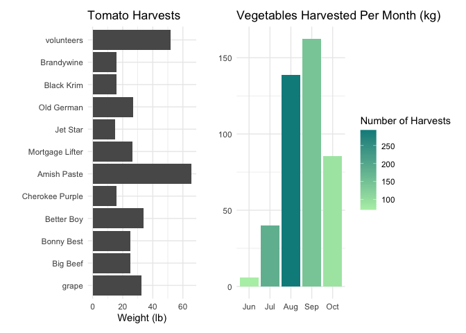

```r
library(tidyverse)     # for data cleaning and plotting
library(gardenR)       # for Lisa's garden data
library(lubridate)     # for date manipulation
library(openintro)     # for the abbr2state() function
library(palmerpenguins)# for Palmer penguin data
library(maps)          # for map data
library(ggmap)         # for mapping points on maps
library(gplots)        # for col2hex() function
library(RColorBrewer)  # for color palettes
library(sf)            # for working with spatial data
library(leaflet)       # for highly customizable mapping
library(ggthemes)      # for more themes (including theme_map())
library(plotly)        # for the ggplotly() - basic interactivity
library(gganimate)     # for adding animation layers to ggplots
library(gifski)        # for creating the gif (don't need to load this library every time,but need it installed)
library(transformr)    # for "tweening" (gganimate)
library(shiny)         # for creating interactive apps
library(patchwork)     # for nicely combining ggplot2 graphs  
library(gt)            # for creating nice tables
library(rvest)         # for scraping data
library(robotstxt)     # for checking if you can scrape data
theme_set(theme_minimal())
```


```r
# Lisa's garden data
data("garden_harvest")

#COVID-19 data from the New York Times
covid19 <- read_csv("https://raw.githubusercontent.com/nytimes/covid-19-data/master/us-states.csv")
```

## Put your homework on GitHub!

Go [here](https://github.com/llendway/github_for_collaboration/blob/master/github_for_collaboration.md) or to previous homework to remind yourself how to get set up. 

Once your repository is created, you should always open your **project** rather than just opening an .Rmd file. You can do that by either clicking on the .Rproj file in your repository folder on your computer. Or, by going to the upper right hand corner in R Studio and clicking the arrow next to where it says Project: (None). You should see your project come up in that list if you've used it recently. You could also go to File --> Open Project and navigate to your .Rproj file. 

## Instructions

* Put your name at the top of the document. 

* **For ALL graphs, you should include appropriate labels.** 

* Feel free to change the default theme, which I currently have set to `theme_minimal()`. 

* Use good coding practice. Read the short sections on good code with [pipes](https://style.tidyverse.org/pipes.html) and [ggplot2](https://style.tidyverse.org/ggplot2.html). **This is part of your grade!**

* **NEW!!** With animated graphs, add `eval=FALSE` to the code chunk that creates the animation and saves it using `anim_save()`. Add another code chunk to reread the gif back into the file. See the [tutorial](https://animation-and-interactivity-in-r.netlify.app/) for help. 

* When you are finished with ALL the exercises, uncomment the options at the top so your document looks nicer. Don't do it before then, or else you might miss some important warnings and messages.

## Your first `shiny` app 

  1. This app will also use the COVID data. Make sure you load that data and all the libraries you need in the `app.R` file you create. Below, you will post a link to the app that you publish on shinyapps.io. You will create an app to compare states' cumulative number of COVID cases over time. The x-axis will be number of days since 20+ cases and the y-axis will be cumulative cases on the log scale (`scale_y_log10()`). We use number of days since 20+ cases on the x-axis so we can make better comparisons of the curve trajectories. You will have an input box where the user can choose which states to compare (`selectInput()`) and have a submit button to click once the user has chosen all states they're interested in comparing. The graph should display a different line for each state, with labels either on the graph or in a legend. Color can be used if needed. 
  
  [app link](https://ioconnor.shinyapps.io/data-science-weekly-exercise-6/)
  
## Warm-up exercises from tutorial

  2. Read in the fake garden harvest data. Find the data [here](https://github.com/llendway/scraping_etc/blob/main/2020_harvest.csv) and click on the `Raw` button to get a direct link to the data. 
  

```r
library(readr)
harvest_2020 <- read_csv("2020_harvest.csv", 
    col_types = cols(weight = col_number()), 
    na = "MISSING", skip = 2) %>%
  select(-X1)
harvest_2020
```

<div data-pagedtable="false">
  <script data-pagedtable-source type="application/json">
{"columns":[{"label":["vegetable"],"name":[1],"type":["chr"],"align":["left"]},{"label":["variety"],"name":[2],"type":["chr"],"align":["left"]},{"label":["date"],"name":[3],"type":["chr"],"align":["left"]},{"label":["weight"],"name":[4],"type":["dbl"],"align":["right"]},{"label":["units"],"name":[5],"type":["chr"],"align":["left"]}],"data":[{"1":"lettuce","2":"reseed","3":"6/6/20","4":"20","5":"grams"},{"1":"radish","2":"Garden Party Mix","3":"6/6/20","4":"36","5":"grams"},{"1":"lettuce","2":"reseed","3":"6/8/20","4":"15","5":"grams"},{"1":"lettuce","2":"reseed","3":"6/9/20","4":"10","5":"grams"},{"1":"radish","2":"Garden Party Mix","3":"6/11/20","4":"67","5":"grams"},{"1":"lettuce","2":"Farmer's Market Blend","3":"6/11/20","4":"12","5":"grams"},{"1":"spinach","2":"Catalina","3":"6/11/20","4":"9","5":"grams"},{"1":"beets","2":"leaves","3":"6/11/20","4":"8","5":"grams"},{"1":"radish","2":"Garden Party Mix","3":"6/13/20","4":"53","5":"grams"},{"1":"lettuce","2":"NA","3":"6/13/20","4":"19","5":"grams"},{"1":"spinach","2":"Catalina","3":"6/13/20","4":"14","5":"grams"},{"1":"kale","2":"Heirloom Lacinto","3":"6/13/20","4":"10","5":"grams"},{"1":"lettuce","2":"Farmer's Market Blend","3":"6/17/20","4":"NA","5":"grams"},{"1":"spinach","2":"Catalina","3":"6/17/20","4":"58","5":"grams"},{"1":"peas","2":"Magnolia Blossom","3":"6/17/20","4":"8","5":"grams"},{"1":"peas","2":"Super Sugar Snap","3":"6/17/20","4":"121","5":"grams"},{"1":"chives","2":"perrenial","3":"6/17/20","4":"8","5":"grams"},{"1":"strawberries","2":"perrenial","3":"6/18/20","4":"40","5":"grams"},{"1":"lettuce","2":"Farmer's Market Blend","3":"6/18/20","4":"47","5":"grams"},{"1":"spinach","2":"NA","3":"6/18/20","4":"59","5":"grams"},{"1":"beets","2":"leaves","3":"6/18/20","4":"25","5":"grams"},{"1":"spinach","2":"Catalina","3":"6/19/20","4":"58","5":"grams"},{"1":"lettuce","2":"Farmer's Market Blend","3":"6/19/20","4":"39","5":"grams"},{"1":"beets","2":"leaves","3":"6/19/20","4":"11","5":"grams"},{"1":"lettuce","2":"Farmer's Market Blend","3":"6/19/20","4":"NA","5":"grams"},{"1":"lettuce","2":"Farmer's Market Blend","3":"6/20/20","4":"22","5":"grams"},{"1":"spinach","2":"Catalina","3":"6/20/20","4":"25","5":"grams"},{"1":"lettuce","2":"Tatsoi","3":"6/20/20","4":"18","5":"grams"},{"1":"radish","2":"Garden Party Mix","3":"6/20/20","4":"16","5":"grams"},{"1":"peas","2":"Magnolia Blossom","3":"6/20/20","4":"71","5":"grams"},{"1":"peas","2":"Super Sugar Snap","3":"6/20/20","4":"148","5":"grams"},{"1":"asparagus","2":"asparagus","3":"6/20/20","4":"20","5":"grams"},{"1":"radish","2":"Garden Party Mix","3":"6/21/20","4":"37","5":"grams"},{"1":"Swiss chard","2":"Neon Glow","3":"6/21/20","4":"19","5":"grams"},{"1":"spinach","2":"Catalina","3":"6/21/20","4":"71","5":"grams"},{"1":"lettuce","2":"Farmer's Market Blend","3":"6/21/20","4":"95","5":"grams"},{"1":"spinach","2":"Catalina","3":"6/21/20","4":"51","5":"grams"},{"1":"Swiss chard","2":"Neon Glow","3":"6/21/20","4":"13","5":"grams"},{"1":"beets","2":"leaves","3":"6/21/20","4":"57","5":"grams"},{"1":"kale","2":"Heirloom Lacinto","3":"6/21/20","4":"60","5":"grams"},{"1":"spinach","2":"Catalina","3":"6/22/20","4":"37","5":"grams"},{"1":"lettuce","2":"Farmer's Market Blend","3":"6/22/20","4":"52","5":"grams"},{"1":"peas","2":"Super Sugar Snap","3":"6/22/20","4":"40","5":"grams"},{"1":"peas","2":"Magnolia Blossom","3":"6/22/20","4":"19","5":"grams"},{"1":"strawberries","2":"perrenial","3":"6/22/20","4":"19","5":"grams"},{"1":"lettuce","2":"Farmer's Market Blend","3":"6/22/20","4":"18","5":"grams"},{"1":"peas","2":"Magnolia Blossom","3":"6/23/20","4":"40","5":"grams"},{"1":"peas","2":"Super Sugar Snap","3":"6/23/20","4":"165","5":"grams"},{"1":"spinach","2":"Catalina","3":"6/23/20","4":"41","5":"grams"},{"1":"cilantro","2":"cilantro","3":"6/23/20","4":"2","5":"grams"},{"1":"basil","2":"Isle of Naxos","3":"6/23/20","4":"5","5":"grams"},{"1":"peas","2":"Super Sugar Snap","3":"6/24/20","4":"34","5":"grams"},{"1":"lettuce","2":"Farmer's Market Blend","3":"6/24/20","4":"122","5":"grams"},{"1":"spinach","2":"Catalina","3":"6/25/20","4":"22","5":"grams"},{"1":"lettuce","2":"Farmer's Market Blend","3":"6/25/20","4":"30","5":"grams"},{"1":"strawberries","2":"perrenial","3":"6/26/20","4":"17","5":"grams"},{"1":"peas","2":"Super Sugar Snap","3":"6/26/20","4":"425","5":"grams"},{"1":"lettuce","2":"Farmer's Market Blend","3":"6/27/20","4":"52","5":"grams"},{"1":"lettuce","2":"Tatsoi","3":"6/27/20","4":"89","5":"grams"},{"1":"spinach","2":"NA","3":"6/27/20","4":"60","5":"grams"},{"1":"peas","2":"Magnolia Blossom","3":"6/27/20","4":"333","5":"grams"},{"1":"peas","2":"Super Sugar Snap","3":"6/28/20","4":"793","5":"grams"},{"1":"spinach","2":"Catalina","3":"6/28/20","4":"99","5":"grams"},{"1":"lettuce","2":"Farmer's Market Blend","3":"6/28/20","4":"111","5":"grams"},{"1":"lettuce","2":"Farmer's Market Blend","3":"6/29/20","4":"58","5":"grams"},{"1":"lettuce","2":"mustard greens","3":"6/29/20","4":"23","5":"grams"},{"1":"peas","2":"Magnolia Blossom","3":"6/29/20","4":"625","5":"grams"},{"1":"peas","2":"Super Sugar Snap","3":"6/29/20","4":"561","5":"grams"},{"1":"raspberries","2":"perrenial","3":"6/29/20","4":"30","5":"grams"},{"1":"lettuce","2":"Farmer's Market Blend","3":"6/29/20","4":"82","5":"grams"},{"1":"Swiss chard","2":"Neon Glow","3":"6/30/20","4":"32","5":"grams"},{"1":"spinach","2":"Catalina","3":"6/30/20","4":"80","5":"grams"},{"1":"lettuce","2":"Farmer's Market Blend","3":"7/1/20","4":"60","5":"grams"},{"1":"lettuce","2":"Tatsoi","3":"7/2/20","4":"144","5":"grams"},{"1":"spinach","2":"Catalina","3":"7/2/20","4":"16","5":"grams"},{"1":"peas","2":"Magnolia Blossom","3":"7/2/20","4":"798","5":"grams"},{"1":"peas","2":"Super Sugar Snap","3":"7/2/20","4":"743","5":"grams"},{"1":"lettuce","2":"Farmer's Market Blend","3":"7/3/20","4":"217","5":"grams"},{"1":"lettuce","2":"Tatsoi","3":"7/3/20","4":"216","5":"grams"},{"1":"radish","2":"Garden Party Mix","3":"7/3/20","4":"88","5":"grams"},{"1":"basil","2":"Isle of Naxos","3":"7/3/20","4":"9","5":"grams"},{"1":"peas","2":"Super Sugar Snap","3":"7/4/20","4":"285","5":"grams"},{"1":"peas","2":"Magnolia Blossom","3":"7/4/20","4":"457","5":"grams"},{"1":"lettuce","2":"Farmer's Market Blend","3":"7/4/20","4":"147","5":"grams"},{"1":"basil","2":"Isle of Naxos","3":"7/6/20","4":"17","5":"grams"},{"1":"zucchini","2":"Romanesco","3":"7/6/20","4":"175","5":"grams"},{"1":"beans","2":"Bush Bush Slender","3":"7/6/20","4":"NA","5":"grams"},{"1":"lettuce","2":"Tatsoi","3":"7/6/20","4":"NA","5":"grams"},{"1":"peas","2":"Magnolia Blossom","3":"7/6/20","4":"433","5":"grams"},{"1":"peas","2":"Super Sugar Snap","3":"7/6/20","4":"48","5":"grams"},{"1":"lettuce","2":"Farmer's Market Blend","3":"7/7/20","4":"67","5":"grams"},{"1":"beets","2":"Gourmet Golden","3":"7/7/20","4":"62","5":"grams"},{"1":"beets","2":"Sweet Merlin","3":"7/7/20","4":"10","5":"grams"},{"1":"radish","2":"Garden Party Mix","3":"7/7/20","4":"43","5":"grams"},{"1":"basil","2":"Isle of Naxos","3":"7/7/20","4":"11","5":"grams"},{"1":"lettuce","2":"Farmer's Market Blend","3":"7/7/20","4":"13","5":"grams"},{"1":"peas","2":"Super Sugar Snap","3":"7/8/20","4":"75","5":"grams"},{"1":"peas","2":"Magnolia Blossom","3":"7/8/20","4":"252","5":"grams"},{"1":"beans","2":"Bush Bush Slender","3":"7/8/20","4":"178","5":"grams"},{"1":"lettuce","2":"Farmer's Market Blend","3":"7/8/20","4":"39","5":"grams"},{"1":"cucumbers","2":"pickling","3":"7/8/20","4":"181","5":"grams"},{"1":"beets","2":"Gourmet Golden","3":"7/8/20","4":"83","5":"grams"},{"1":"Swiss chard","2":"Neon Glow","3":"7/8/20","4":"96","5":"grams"},{"1":"lettuce","2":"Tatsoi","3":"7/8/20","4":"75","5":"grams"},{"1":"lettuce","2":"Farmer's Market Blend","3":"7/9/20","4":"61","5":"grams"},{"1":"raspberries","2":"perrenial","3":"7/9/20","4":"131","5":"grams"},{"1":"beans","2":"Bush Bush Slender","3":"7/9/20","4":"140","5":"grams"},{"1":"beets","2":"Sweet Merlin","3":"7/9/20","4":"69","5":"grams"},{"1":"cucumbers","2":"pickling","3":"7/9/20","4":"78","5":"grams"},{"1":"raspberries","2":"perrenial","3":"7/10/20","4":"61","5":"grams"},{"1":"basil","2":"Isle of Naxos","3":"7/10/20","4":"150","5":"grams"},{"1":"raspberries","2":"perrenial","3":"7/11/20","4":"60","5":"grams"},{"1":"strawberries","2":"perrenial","3":"7/11/20","4":"77","5":"grams"},{"1":"spinach","2":"Catalina","3":"7/11/20","4":"19","5":"grams"},{"1":"lettuce","2":"Farmer's Market Blend","3":"7/11/20","4":"79","5":"grams"},{"1":"raspberries","2":"perrenial","3":"7/11/20","4":"105","5":"grams"},{"1":"beans","2":"Bush Bush Slender","3":"7/11/20","4":"701","5":"grams"},{"1":"tomatoes","2":"grape","3":"7/11/20","4":"24","5":"grams"},{"1":"cucumbers","2":"pickling","3":"7/12/20","4":"130","5":"grams"},{"1":"beets","2":"Sweet Merlin","3":"7/12/20","4":"89","5":"grams"},{"1":"zucchini","2":"Romanesco","3":"7/12/20","4":"492","5":"grams"},{"1":"lettuce","2":"Farmer's Market Blend","3":"7/12/20","4":"83","5":"grams"},{"1":"cucumbers","2":"pickling","3":"7/13/20","4":"47","5":"grams"},{"1":"zucchini","2":"Romanesco","3":"7/13/20","4":"145","5":"grams"},{"1":"radish","2":"Garden Party Mix","3":"7/13/20","4":"50","5":"grams"},{"1":"strawberries","2":"perrenial","3":"7/13/20","4":"85","5":"grams"},{"1":"lettuce","2":"Farmer's Market Blend","3":"7/13/20","4":"53","5":"grams"},{"1":"lettuce","2":"Tatsoi","3":"7/13/20","4":"137","5":"grams"},{"1":"peas","2":"Super Sugar Snap","3":"7/13/20","4":"40","5":"grams"},{"1":"beans","2":"Bush Bush Slender","3":"7/13/20","4":"443","5":"grams"},{"1":"kale","2":"Heirloom Lacinto","3":"7/14/20","4":"128","5":"grams"},{"1":"cucumbers","2":"pickling","3":"7/14/20","4":"152","5":"grams"},{"1":"peas","2":"Magnolia Blossom","3":"7/14/20","4":"207","5":"grams"},{"1":"peas","2":"Super Sugar Snap","3":"7/14/20","4":"526","5":"grams"},{"1":"raspberries","2":"perrenial","3":"7/14/20","4":"152","5":"grams"},{"1":"zucchini","2":"Romanesco","3":"7/15/20","4":"393","5":"grams"},{"1":"beans","2":"Bush Bush Slender","3":"7/15/20","4":"743","5":"grams"},{"1":"cucumbers","2":"pickling","3":"7/15/20","4":"1057","5":"grams"},{"1":"spinach","2":"Catalina","3":"7/15/20","4":"39","5":"grams"},{"1":"Swiss chard","2":"Neon Glow","3":"7/16/20","4":"29","5":"grams"},{"1":"lettuce","2":"Farmer's Market Blend","3":"7/16/20","4":"61","5":"grams"},{"1":"onions","2":"Delicious Duo","3":"7/16/20","4":"50","5":"grams"},{"1":"strawberries","2":"perrenial","3":"7/17/20","4":"88","5":"grams"},{"1":"cilantro","2":"cilantro","3":"7/17/20","4":"33","5":"grams"},{"1":"basil","2":"Isle of Naxos","3":"7/17/20","4":"16","5":"grams"},{"1":"jalapeño","2":"giant","3":"7/17/20","4":"20","5":"grams"},{"1":"cucumbers","2":"pickling","3":"7/17/20","4":"347","5":"grams"},{"1":"raspberries","2":"perrenial","3":"7/18/20","4":"77","5":"grams"},{"1":"beets","2":"Sweet Merlin","3":"7/18/20","4":"172","5":"grams"},{"1":"kale","2":"Heirloom Lacinto","3":"7/18/20","4":"61","5":"grams"},{"1":"zucchini","2":"Romanesco","3":"7/18/20","4":"81","5":"grams"},{"1":"cucumbers","2":"pickling","3":"7/18/20","4":"294","5":"grams"},{"1":"beans","2":"Bush Bush Slender","3":"7/18/20","4":"660","5":"grams"},{"1":"kale","2":"Heirloom Lacinto","3":"7/19/20","4":"113","5":"grams"},{"1":"cucumbers","2":"pickling","3":"7/19/20","4":"531","5":"grams"},{"1":"zucchini","2":"Romanesco","3":"7/19/20","4":"344","5":"grams"},{"1":"strawberries","2":"perrenial","3":"7/19/20","4":"37","5":"grams"},{"1":"peas","2":"Magnolia Blossom","3":"7/19/20","4":"140","5":"grams"},{"1":"zucchini","2":"Romanesco","3":"7/20/20","4":"134","5":"grams"},{"1":"cucumbers","2":"pickling","3":"7/20/20","4":"179","5":"grams"},{"1":"peas","2":"Super Sugar Snap","3":"7/20/20","4":"336","5":"grams"},{"1":"beets","2":"Gourmet Golden","3":"7/20/20","4":"107","5":"grams"},{"1":"kale","2":"Heirloom Lacinto","3":"7/20/20","4":"128","5":"grams"},{"1":"hot peppers","2":"thai","3":"7/20/20","4":"12","5":"grams"},{"1":"beans","2":"Bush Bush Slender","3":"7/20/20","4":"519","5":"grams"},{"1":"hot peppers","2":"variety","3":"7/20/20","4":"559","5":"grams"},{"1":"jalapeño","2":"giant","3":"7/20/20","4":"197","5":"grams"},{"1":"lettuce","2":"Tatsoi","3":"7/20/20","4":"123","5":"grams"},{"1":"Swiss chard","2":"Neon Glow","3":"7/20/20","4":"178","5":"grams"},{"1":"onions","2":"Long Keeping Rainbow","3":"7/20/20","4":"102","5":"grams"},{"1":"zucchini","2":"Romanesco","3":"7/21/20","4":"110","5":"grams"},{"1":"tomatoes","2":"grape","3":"7/21/20","4":"86","5":"grams"},{"1":"tomatoes","2":"Big Beef","3":"7/21/20","4":"137","5":"grams"},{"1":"tomatoes","2":"Bonny Best","3":"7/21/20","4":"339","5":"grams"},{"1":"beans","2":"Bush Bush Slender","3":"7/21/20","4":"21","5":"grams"},{"1":"spinach","2":"Catalina","3":"7/21/20","4":"21","5":"grams"},{"1":"basil","2":"Isle of Naxos","3":"7/21/20","4":"7","5":"grams"},{"1":"zucchini","2":"Romanesco","3":"7/22/20","4":"76","5":"grams"},{"1":"beans","2":"Bush Bush Slender","3":"7/22/20","4":"351","5":"grams"},{"1":"cucumbers","2":"pickling","3":"7/22/20","4":"655","5":"grams"},{"1":"lettuce","2":"Lettuce Mixture","3":"7/22/20","4":"23","5":"grams"},{"1":"beans","2":"Bush Bush Slender","3":"7/23/20","4":"129","5":"grams"},{"1":"carrots","2":"King Midas","3":"7/23/20","4":"56","5":"grams"},{"1":"Swiss chard","2":"Neon Glow","3":"7/23/20","4":"466","5":"grams"},{"1":"onions","2":"Long Keeping Rainbow","3":"7/23/20","4":"91","5":"grams"},{"1":"lettuce","2":"Lettuce Mixture","3":"7/23/20","4":"130","5":"grams"},{"1":"cucumbers","2":"pickling","3":"7/24/20","4":"525","5":"grams"},{"1":"tomatoes","2":"grape","3":"7/24/20","4":"31","5":"grams"},{"1":"tomatoes","2":"Bonny Best","3":"7/24/20","4":"140","5":"grams"},{"1":"tomatoes","2":"Cherokee Purple","3":"7/24/20","4":"247","5":"grams"},{"1":"tomatoes","2":"Better Boy","3":"7/24/20","4":"220","5":"grams"},{"1":"zucchini","2":"Romanesco","3":"7/24/20","4":"1321","5":"grams"},{"1":"beans","2":"Bush Bush Slender","3":"7/24/20","4":"100","5":"grams"},{"1":"raspberries","2":"perrenial","3":"7/24/20","4":"32","5":"grams"},{"1":"strawberries","2":"perrenial","3":"7/24/20","4":"93","5":"grams"},{"1":"lettuce","2":"Lettuce Mixture","3":"7/24/20","4":"16","5":"grams"},{"1":"basil","2":"Isle of Naxos","3":"7/24/20","4":"3","5":"grams"},{"1":"peppers","2":"variety","3":"7/24/20","4":"68","5":"grams"},{"1":"carrots","2":"King Midas","3":"7/24/20","4":"178","5":"grams"},{"1":"carrots","2":"Dragon","3":"7/24/20","4":"80","5":"grams"},{"1":"tomatoes","2":"Amish Paste","3":"7/25/20","4":"463","5":"grams"},{"1":"tomatoes","2":"grape","3":"7/25/20","4":"106","5":"grams"},{"1":"kale","2":"Heirloom Lacinto","3":"7/25/20","4":"121","5":"grams"},{"1":"cucumbers","2":"pickling","3":"7/25/20","4":"901","5":"grams"},{"1":"lettuce","2":"Lettuce Mixture","3":"7/26/20","4":"81","5":"grams"},{"1":"tomatoes","2":"Bonny Best","3":"7/26/20","4":"148","5":"grams"},{"1":"zucchini","2":"Romanesco","3":"7/27/20","4":"1542","5":"grams"},{"1":"beans","2":"Bush Bush Slender","3":"7/27/20","4":"728","5":"grams"},{"1":"cucumbers","2":"pickling","3":"7/27/20","4":"785","5":"grams"},{"1":"strawberries","2":"perrenial","3":"7/27/20","4":"113","5":"grams"},{"1":"raspberries","2":"perrenial","3":"7/27/20","4":"29","5":"grams"},{"1":"tomatoes","2":"Mortgage Lifter","3":"7/27/20","4":"801","5":"grams"},{"1":"lettuce","2":"Lettuce Mixture","3":"7/27/20","4":"99","5":"grams"},{"1":"beets","2":"Sweet Merlin","3":"7/27/20","4":"49","5":"grams"},{"1":"beets","2":"Gourmet Golden","3":"7/27/20","4":"149","5":"grams"},{"1":"radish","2":"Garden Party Mix","3":"7/27/20","4":"39","5":"grams"},{"1":"carrots","2":"King Midas","3":"7/27/20","4":"174","5":"grams"},{"1":"onions","2":"Long Keeping Rainbow","3":"7/27/20","4":"129","5":"grams"},{"1":"broccoli","2":"Yod Fah","3":"7/27/20","4":"372","5":"grams"},{"1":"carrots","2":"King Midas","3":"7/28/20","4":"160","5":"grams"},{"1":"tomatoes","2":"Old German","3":"7/28/20","4":"611","5":"grams"},{"1":"tomatoes","2":"Big Beef","3":"7/28/20","4":"203","5":"grams"},{"1":"tomatoes","2":"Better Boy","3":"7/28/20","4":"312","5":"grams"},{"1":"tomatoes","2":"Jet Star","3":"7/28/20","4":"315","5":"grams"},{"1":"tomatoes","2":"grape","3":"7/28/20","4":"131","5":"grams"},{"1":"lettuce","2":"Lettuce Mixture","3":"7/28/20","4":"91","5":"grams"},{"1":"cucumbers","2":"pickling","3":"7/28/20","4":"76","5":"grams"},{"1":"tomatoes","2":"Bonny Best","3":"7/29/20","4":"153","5":"grams"},{"1":"tomatoes","2":"Better Boy","3":"7/29/20","4":"442","5":"grams"},{"1":"tomatoes","2":"Cherokee Purple","3":"7/29/20","4":"240","5":"grams"},{"1":"tomatoes","2":"Amish Paste","3":"7/29/20","4":"209","5":"grams"},{"1":"lettuce","2":"Lettuce Mixture","3":"7/29/20","4":"73","5":"grams"},{"1":"tomatoes","2":"grape","3":"7/29/20","4":"40","5":"grams"},{"1":"zucchini","2":"Romanesco","3":"7/29/20","4":"457","5":"grams"},{"1":"cucumbers","2":"pickling","3":"7/29/20","4":"514","5":"grams"},{"1":"beans","2":"Bush Bush Slender","3":"7/29/20","4":"305","5":"grams"},{"1":"kale","2":"Heirloom Lacinto","3":"7/29/20","4":"280","5":"grams"},{"1":"tomatoes","2":"grape","3":"7/30/20","4":"91","5":"grams"},{"1":"beets","2":"Sweet Merlin","3":"7/30/20","4":"101","5":"grams"},{"1":"onions","2":"Long Keeping Rainbow","3":"7/30/20","4":"19","5":"grams"},{"1":"lettuce","2":"Lettuce Mixture","3":"7/30/20","4":"94","5":"grams"},{"1":"carrots","2":"Bolero","3":"7/30/20","4":"116","5":"grams"},{"1":"carrots","2":"King Midas","3":"7/30/20","4":"107","5":"grams"},{"1":"cucumbers","2":"pickling","3":"7/30/20","4":"626","5":"grams"},{"1":"tomatoes","2":"Cherokee Purple","3":"7/31/20","4":"307","5":"grams"},{"1":"tomatoes","2":"Amish Paste","3":"7/31/20","4":"197","5":"grams"},{"1":"tomatoes","2":"Old German","3":"7/31/20","4":"633","5":"grams"},{"1":"tomatoes","2":"Better Boy","3":"7/31/20","4":"290","5":"grams"},{"1":"tomatoes","2":"grape","3":"7/31/20","4":"100","5":"grams"},{"1":"zucchini","2":"Romanesco","3":"7/31/20","4":"1215","5":"grams"},{"1":"beans","2":"Bush Bush Slender","3":"7/31/20","4":"592","5":"grams"},{"1":"strawberries","2":"perrenial","3":"7/31/20","4":"23","5":"grams"},{"1":"spinach","2":"Catalina","3":"7/31/20","4":"31","5":"grams"},{"1":"lettuce","2":"Lettuce Mixture","3":"7/31/20","4":"107","5":"grams"},{"1":"cucumbers","2":"pickling","3":"7/31/20","4":"174","5":"grams"},{"1":"tomatoes","2":"Bonny Best","3":"8/1/20","4":"435","5":"grams"},{"1":"tomatoes","2":"Brandywine","3":"8/1/20","4":"320","5":"grams"},{"1":"tomatoes","2":"Cherokee Purple","3":"8/1/20","4":"619","5":"grams"},{"1":"tomatoes","2":"Amish Paste","3":"8/1/20","4":"97","5":"grams"},{"1":"tomatoes","2":"Black Krim","3":"8/1/20","4":"436","5":"grams"},{"1":"tomatoes","2":"grape","3":"8/1/20","4":"168","5":"grams"},{"1":"zucchini","2":"Romanesco","3":"8/1/20","4":"164","5":"grams"},{"1":"cucumbers","2":"pickling","3":"8/1/20","4":"1130","5":"grams"},{"1":"basil","2":"Isle of Naxos","3":"8/1/20","4":"137","5":"grams"},{"1":"jalapeño","2":"giant","3":"8/1/20","4":"74","5":"grams"},{"1":"cilantro","2":"cilantro","3":"8/1/20","4":"17","5":"grams"},{"1":"onions","2":"Delicious Duo","3":"8/1/20","4":"182","5":"grams"},{"1":"zucchini","2":"Romanesco","3":"8/2/20","4":"1175","5":"grams"},{"1":"tomatoes","2":"Amish Paste","3":"8/2/20","4":"509","5":"grams"},{"1":"tomatoes","2":"Black Krim","3":"8/2/20","4":"857","5":"grams"},{"1":"tomatoes","2":"Old German","3":"8/2/20","4":"336","5":"grams"},{"1":"tomatoes","2":"Bonny Best","3":"8/2/20","4":"156","5":"grams"},{"1":"tomatoes","2":"Better Boy","3":"8/2/20","4":"211","5":"grams"},{"1":"tomatoes","2":"grape","3":"8/2/20","4":"102","5":"grams"},{"1":"tomatoes","2":"Better Boy","3":"8/3/20","4":"308","5":"grams"},{"1":"zucchini","2":"Romanesco","3":"8/3/20","4":"252","5":"grams"},{"1":"cucumbers","2":"pickling","3":"8/3/20","4":"1155","5":"grams"},{"1":"beans","2":"Bush Bush Slender","3":"8/3/20","4":"572","5":"grams"},{"1":"lettuce","2":"Lettuce Mixture","3":"8/3/20","4":"65","5":"grams"},{"1":"kale","2":"Heirloom Lacinto","3":"8/3/20","4":"383","5":"grams"},{"1":"tomatoes","2":"Bonny Best","3":"8/4/20","4":"387","5":"grams"},{"1":"tomatoes","2":"Brandywine","3":"8/4/20","4":"231","5":"grams"},{"1":"tomatoes","2":"volunteers","3":"8/4/20","4":"73","5":"grams"},{"1":"tomatoes","2":"Mortgage Lifter","3":"8/4/20","4":"339","5":"grams"},{"1":"tomatoes","2":"grape","3":"8/4/20","4":"118","5":"grams"},{"1":"peppers","2":"variety","3":"8/4/20","4":"270","5":"grams"},{"1":"jalapeño","2":"giant","3":"8/4/20","4":"162","5":"grams"},{"1":"lettuce","2":"Lettuce Mixture","3":"8/4/20","4":"56","5":"grams"},{"1":"peppers","2":"variety","3":"8/4/20","4":"192","5":"grams"},{"1":"onions","2":"Long Keeping Rainbow","3":"8/4/20","4":"195","5":"grams"},{"1":"peppers","2":"green","3":"8/4/20","4":"81","5":"grams"},{"1":"jalapeño","2":"giant","3":"8/4/20","4":"87","5":"grams"},{"1":"hot peppers","2":"thai","3":"8/4/20","4":"24","5":"grams"},{"1":"hot peppers","2":"variety","3":"8/4/20","4":"40","5":"grams"},{"1":"spinach","2":"Catalina","3":"8/4/20","4":"44","5":"grams"},{"1":"zucchini","2":"Romanesco","3":"8/4/20","4":"427","5":"grams"},{"1":"tomatoes","2":"Bonny Best","3":"8/5/20","4":"563","5":"grams"},{"1":"tomatoes","2":"Brandywine","3":"8/5/20","4":"290","5":"grams"},{"1":"tomatoes","2":"Mortgage Lifter","3":"8/5/20","4":"781","5":"grams"},{"1":"tomatoes","2":"Big Beef","3":"8/5/20","4":"223","5":"grams"},{"1":"tomatoes","2":"Amish Paste","3":"8/5/20","4":"382","5":"grams"},{"1":"tomatoes","2":"grape","3":"8/5/20","4":"217","5":"grams"},{"1":"tomatoes","2":"volunteers","3":"8/5/20","4":"67","5":"grams"},{"1":"beans","2":"Classic Slenderette","3":"8/5/20","4":"41","5":"grams"},{"1":"beans","2":"Bush Bush Slender","3":"8/5/20","4":"234","5":"grams"},{"1":"tomatoes","2":"Black Krim","3":"8/6/20","4":"393","5":"grams"},{"1":"tomatoes","2":"Big Beef","3":"8/6/20","4":"307","5":"grams"},{"1":"tomatoes","2":"Amish Paste","3":"8/6/20","4":"175","5":"grams"},{"1":"tomatoes","2":"Cherokee Purple","3":"8/6/20","4":"303","5":"grams"},{"1":"cucumbers","2":"pickling","3":"8/6/20","4":"127","5":"grams"},{"1":"lettuce","2":"Lettuce Mixture","3":"8/6/20","4":"98","5":"grams"},{"1":"carrots","2":"Bolero","3":"8/6/20","4":"164","5":"grams"},{"1":"carrots","2":"Dragon","3":"8/6/20","4":"442","5":"grams"},{"1":"potatoes","2":"purple","3":"8/6/20","4":"317","5":"grams"},{"1":"potatoes","2":"yellow","3":"8/6/20","4":"439","5":"grams"},{"1":"tomatoes","2":"Bonny Best","3":"8/7/20","4":"359","5":"grams"},{"1":"tomatoes","2":"Brandywine","3":"8/7/20","4":"356","5":"grams"},{"1":"tomatoes","2":"Old German","3":"8/7/20","4":"233","5":"grams"},{"1":"tomatoes","2":"Mortgage Lifter","3":"8/7/20","4":"364","5":"grams"},{"1":"tomatoes","2":"Better Boy","3":"8/7/20","4":"1045","5":"grams"},{"1":"tomatoes","2":"Jet Star","3":"8/7/20","4":"562","5":"grams"},{"1":"tomatoes","2":"grape","3":"8/7/20","4":"292","5":"grams"},{"1":"zucchini","2":"Romanesco","3":"8/7/20","4":"1219","5":"grams"},{"1":"cucumbers","2":"pickling","3":"8/7/20","4":"1327","5":"grams"},{"1":"carrots","2":"Bolero","3":"8/7/20","4":"255","5":"grams"},{"1":"lettuce","2":"Lettuce Mixture","3":"8/7/20","4":"19","5":"grams"},{"1":"tomatoes","2":"Big Beef","3":"8/8/20","4":"162","5":"grams"},{"1":"tomatoes","2":"grape","3":"8/8/20","4":"81","5":"grams"},{"1":"tomatoes","2":"Bonny Best","3":"8/8/20","4":"564","5":"grams"},{"1":"tomatoes","2":"Jet Star","3":"8/8/20","4":"184","5":"grams"},{"1":"beans","2":"Chinese Red Noodle","3":"8/8/20","4":"108","5":"grams"},{"1":"beans","2":"Classic Slenderette","3":"8/8/20","4":"122","5":"grams"},{"1":"cucumbers","2":"pickling","3":"8/8/20","4":"1697","5":"grams"},{"1":"beans","2":"Bush Bush Slender","3":"8/8/20","4":"545","5":"grams"},{"1":"zucchini","2":"Romanesco","3":"8/8/20","4":"445","5":"grams"},{"1":"kale","2":"Heirloom Lacinto","3":"8/8/20","4":"305","5":"grams"},{"1":"tomatoes","2":"Bonny Best","3":"8/9/20","4":"179","5":"grams"},{"1":"tomatoes","2":"Jet Star","3":"8/9/20","4":"591","5":"grams"},{"1":"tomatoes","2":"Better Boy","3":"8/9/20","4":"1102","5":"grams"},{"1":"tomatoes","2":"Cherokee Purple","3":"8/9/20","4":"308","5":"grams"},{"1":"tomatoes","2":"volunteers","3":"8/9/20","4":"54","5":"grams"},{"1":"tomatoes","2":"grape","3":"8/9/20","4":"64","5":"grams"},{"1":"zucchini","2":"Romanesco","3":"8/9/20","4":"443","5":"grams"},{"1":"onions","2":"Long Keeping Rainbow","3":"8/9/20","4":"118","5":"grams"},{"1":"Swiss chard","2":"Neon Glow","3":"8/9/20","4":"302","5":"grams"},{"1":"basil","2":"Isle of Naxos","3":"8/10/20","4":"13","5":"grams"},{"1":"potatoes","2":"yellow","3":"8/10/20","4":"272","5":"grams"},{"1":"potatoes","2":"purple","3":"8/10/20","4":"168","5":"grams"},{"1":"tomatoes","2":"Cherokee Purple","3":"8/10/20","4":"216","5":"grams"},{"1":"tomatoes","2":"Jet Star","3":"8/10/20","4":"241","5":"grams"},{"1":"Swiss chard","2":"Neon Glow","3":"8/10/20","4":"309","5":"grams"},{"1":"carrots","2":"Bolero","3":"8/10/20","4":"221","5":"grams"},{"1":"zucchini","2":"Romanesco","3":"8/11/20","4":"731","5":"grams"},{"1":"tomatoes","2":"grape","3":"8/11/20","4":"302","5":"grams"},{"1":"tomatoes","2":"Bonny Best","3":"8/11/20","4":"307","5":"grams"},{"1":"tomatoes","2":"volunteers","3":"8/11/20","4":"160","5":"grams"},{"1":"beans","2":"Bush Bush Slender","3":"8/11/20","4":"755","5":"grams"},{"1":"cucumbers","2":"pickling","3":"8/11/20","4":"1029","5":"grams"},{"1":"beans","2":"Chinese Red Noodle","3":"8/11/20","4":"78","5":"grams"},{"1":"beans","2":"Classic Slenderette","3":"8/11/20","4":"245","5":"grams"},{"1":"tomatoes","2":"Brandywine","3":"8/11/20","4":"218","5":"grams"},{"1":"tomatoes","2":"Cherokee Purple","3":"8/11/20","4":"802","5":"grams"},{"1":"tomatoes","2":"Better Boy","3":"8/11/20","4":"354","5":"grams"},{"1":"tomatoes","2":"Black Krim","3":"8/11/20","4":"359","5":"grams"},{"1":"tomatoes","2":"Amish Paste","3":"8/11/20","4":"506","5":"grams"},{"1":"lettuce","2":"Lettuce Mixture","3":"8/11/20","4":"92","5":"grams"},{"1":"edamame","2":"edamame","3":"8/11/20","4":"109","5":"grams"},{"1":"corn","2":"Dorinny Sweet","3":"8/11/20","4":"330","5":"grams"},{"1":"lettuce","2":"Lettuce Mixture","3":"8/12/20","4":"73","5":"grams"},{"1":"zucchini","2":"Romanesco","3":"8/13/20","4":"1774","5":"grams"},{"1":"beans","2":"Bush Bush Slender","3":"8/13/20","4":"468","5":"grams"},{"1":"beans","2":"Classic Slenderette","3":"8/13/20","4":"122","5":"grams"},{"1":"tomatoes","2":"grape","3":"8/13/20","4":"421","5":"grams"},{"1":"tomatoes","2":"Bonny Best","3":"8/13/20","4":"332","5":"grams"},{"1":"tomatoes","2":"Better Boy","3":"8/13/20","4":"727","5":"grams"},{"1":"tomatoes","2":"Amish Paste","3":"8/13/20","4":"642","5":"grams"},{"1":"tomatoes","2":"Big Beef","3":"8/13/20","4":"413","5":"grams"},{"1":"beans","2":"Chinese Red Noodle","3":"8/13/20","4":"65","5":"grams"},{"1":"cucumbers","2":"pickling","3":"8/13/20","4":"599","5":"grams"},{"1":"basil","2":"Isle of Naxos","3":"8/13/20","4":"12","5":"grams"},{"1":"beets","2":"Sweet Merlin","3":"8/13/20","4":"198","5":"grams"},{"1":"beets","2":"Gourmet Golden","3":"8/13/20","4":"308","5":"grams"},{"1":"Swiss chard","2":"Neon Glow","3":"8/13/20","4":"517","5":"grams"},{"1":"beets","2":"Sweet Merlin","3":"8/13/20","4":"2209","5":"grams"},{"1":"beets","2":"Gourmet Golden","3":"8/13/20","4":"2476","5":"grams"},{"1":"corn","2":"Dorinny Sweet","3":"8/14/20","4":"1564","5":"grams"},{"1":"lettuce","2":"Lettuce Mixture","3":"8/14/20","4":"80","5":"grams"},{"1":"tomatoes","2":"Bonny Best","3":"8/14/20","4":"711","5":"grams"},{"1":"tomatoes","2":"Old German","3":"8/14/20","4":"238","5":"grams"},{"1":"tomatoes","2":"Amish Paste","3":"8/14/20","4":"525","5":"grams"},{"1":"tomatoes","2":"Jet Star","3":"8/14/20","4":"181","5":"grams"},{"1":"tomatoes","2":"Big Beef","3":"8/14/20","4":"266","5":"grams"},{"1":"tomatoes","2":"volunteers","3":"8/14/20","4":"490","5":"grams"},{"1":"tomatoes","2":"grape","3":"8/14/20","4":"126","5":"grams"},{"1":"zucchini","2":"Romanesco","3":"8/14/20","4":"371","5":"grams"},{"1":"corn","2":"Golden Bantam","3":"8/15/20","4":"383","5":"grams"},{"1":"cucumbers","2":"pickling","3":"8/15/20","4":"351","5":"grams"},{"1":"zucchini","2":"Romanesco","3":"8/15/20","4":"859","5":"grams"},{"1":"basil","2":"Isle of Naxos","3":"8/15/20","4":"25","5":"grams"},{"1":"onions","2":"Long Keeping Rainbow","3":"8/15/20","4":"137","5":"grams"},{"1":"kale","2":"Heirloom Lacinto","3":"8/15/20","4":"71","5":"grams"},{"1":"lettuce","2":"Lettuce Mixture","3":"8/15/20","4":"56","5":"grams"},{"1":"tomatoes","2":"grape","3":"8/16/20","4":"477","5":"grams"},{"1":"tomatoes","2":"volunteers","3":"8/16/20","4":"328","5":"grams"},{"1":"lettuce","2":"Lettuce Mixture","3":"8/16/20","4":"45","5":"grams"},{"1":"tomatoes","2":"Bonny Best","3":"8/16/20","4":"543","5":"grams"},{"1":"tomatoes","2":"Old German","3":"8/16/20","4":"599","5":"grams"},{"1":"tomatoes","2":"Amish Paste","3":"8/16/20","4":"560","5":"grams"},{"1":"tomatoes","2":"Black Krim","3":"8/16/20","4":"291","5":"grams"},{"1":"tomatoes","2":"Better Boy","3":"8/16/20","4":"238","5":"grams"},{"1":"tomatoes","2":"Big Beef","3":"8/16/20","4":"397","5":"grams"},{"1":"zucchini","2":"Romanesco","3":"8/16/20","4":"660","5":"grams"},{"1":"beans","2":"Bush Bush Slender","3":"8/16/20","4":"693","5":"grams"},{"1":"tomatoes","2":"Bonny Best","3":"8/17/20","4":"364","5":"grams"},{"1":"tomatoes","2":"Brandywine","3":"8/17/20","4":"305","5":"grams"},{"1":"tomatoes","2":"Amish Paste","3":"8/17/20","4":"588","5":"grams"},{"1":"tomatoes","2":"Better Boy","3":"8/17/20","4":"764","5":"grams"},{"1":"tomatoes","2":"grape","3":"8/17/20","4":"436","5":"grams"},{"1":"tomatoes","2":"volunteers","3":"8/17/20","4":"306","5":"grams"},{"1":"beans","2":"Classic Slenderette","3":"8/17/20","4":"350","5":"grams"},{"1":"beans","2":"Chinese Red Noodle","3":"8/17/20","4":"105","5":"grams"},{"1":"spinach","2":"Catalina","3":"8/17/20","4":"30","5":"grams"},{"1":"lettuce","2":"Lettuce Mixture","3":"8/17/20","4":"67","5":"grams"},{"1":"corn","2":"Golden Bantam","3":"8/17/20","4":"344","5":"grams"},{"1":"kale","2":"Heirloom Lacinto","3":"8/17/20","4":"173","5":"grams"},{"1":"basil","2":"Isle of Naxos","3":"8/18/20","4":"27","5":"grams"},{"1":"onions","2":"Long Keeping Rainbow","3":"8/18/20","4":"126","5":"grams"},{"1":"peppers","2":"variety","3":"8/18/20","4":"112","5":"grams"},{"1":"zucchini","2":"Romanesco","3":"8/18/20","4":"1151","5":"grams"},{"1":"beans","2":"Bush Bush Slender","3":"8/18/20","4":"225","5":"grams"},{"1":"cucumbers","2":"pickling","3":"8/18/20","4":"2888","5":"grams"},{"1":"tomatoes","2":"Mortgage Lifter","3":"8/18/20","4":"608","5":"grams"},{"1":"tomatoes","2":"grape","3":"8/18/20","4":"136","5":"grams"},{"1":"tomatoes","2":"volunteers","3":"8/18/20","4":"148","5":"grams"},{"1":"tomatoes","2":"Black Krim","3":"8/18/20","4":"317","5":"grams"},{"1":"tomatoes","2":"Old German","3":"8/18/20","4":"105","5":"grams"},{"1":"tomatoes","2":"Bonny Best","3":"8/18/20","4":"271","5":"grams"},{"1":"spinach","2":"Catalina","3":"8/18/20","4":"39","5":"grams"},{"1":"lettuce","2":"Lettuce Mixture","3":"8/18/20","4":"87","5":"grams"},{"1":"cucumbers","2":"pickling","3":"8/18/20","4":"233","5":"grams"},{"1":"edamame","2":"edamame","3":"8/18/20","4":"527","5":"grams"},{"1":"potatoes","2":"purple","3":"8/19/20","4":"323","5":"grams"},{"1":"potatoes","2":"yellow","3":"8/19/20","4":"278","5":"grams"},{"1":"hot peppers","2":"thai","3":"8/19/20","4":"31","5":"grams"},{"1":"tomatoes","2":"Cherokee Purple","3":"8/19/20","4":"872","5":"grams"},{"1":"tomatoes","2":"Black Krim","3":"8/19/20","4":"579","5":"grams"},{"1":"tomatoes","2":"Better Boy","3":"8/19/20","4":"615","5":"grams"},{"1":"tomatoes","2":"Amish Paste","3":"8/19/20","4":"997","5":"grams"},{"1":"tomatoes","2":"Brandywine","3":"8/19/20","4":"335","5":"grams"},{"1":"tomatoes","2":"Big Beef","3":"8/19/20","4":"264","5":"grams"},{"1":"tomatoes","2":"grape","3":"8/19/20","4":"451","5":"grams"},{"1":"tomatoes","2":"volunteers","3":"8/19/20","4":"306","5":"grams"},{"1":"lettuce","2":"Lettuce Mixture","3":"8/20/20","4":"99","5":"grams"},{"1":"cucumbers","2":"pickling","3":"8/20/20","4":"70","5":"grams"},{"1":"tomatoes","2":"volunteers","3":"8/20/20","4":"333","5":"grams"},{"1":"tomatoes","2":"Brandywine","3":"8/20/20","4":"483","5":"grams"},{"1":"tomatoes","2":"Bonny Best","3":"8/20/20","4":"632","5":"grams"},{"1":"tomatoes","2":"Jet Star","3":"8/20/20","4":"360","5":"grams"},{"1":"tomatoes","2":"Better Boy","3":"8/20/20","4":"230","5":"grams"},{"1":"tomatoes","2":"Big Beef","3":"8/20/20","4":"344","5":"grams"},{"1":"tomatoes","2":"Amish Paste","3":"8/20/20","4":"1010","5":"grams"},{"1":"beans","2":"Classic Slenderette","3":"8/20/20","4":"328","5":"grams"},{"1":"beans","2":"Bush Bush Slender","3":"8/20/20","4":"287","5":"grams"},{"1":"lettuce","2":"Tatsoi","3":"8/20/20","4":"322","5":"grams"},{"1":"tomatoes","2":"grape","3":"8/20/20","4":"493","5":"grams"},{"1":"peppers","2":"green","3":"8/20/20","4":"252","5":"grams"},{"1":"peppers","2":"variety","3":"8/20/20","4":"70","5":"grams"},{"1":"zucchini","2":"Romanesco","3":"8/20/20","4":"834","5":"grams"},{"1":"onions","2":"Long Keeping Rainbow","3":"8/20/20","4":"113","5":"grams"},{"1":"zucchini","2":"Romanesco","3":"8/21/20","4":"1122","5":"grams"},{"1":"basil","2":"Isle of Naxos","3":"8/21/20","4":"34","5":"grams"},{"1":"jalapeño","2":"giant","3":"8/21/20","4":"509","5":"grams"},{"1":"tomatoes","2":"Cherokee Purple","3":"8/21/20","4":"1601","5":"grams"},{"1":"tomatoes","2":"Big Beef","3":"8/21/20","4":"842","5":"grams"},{"1":"tomatoes","2":"Black Krim","3":"8/21/20","4":"1538","5":"grams"},{"1":"tomatoes","2":"Amish Paste","3":"8/21/20","4":"428","5":"grams"},{"1":"tomatoes","2":"Old German","3":"8/21/20","4":"243","5":"grams"},{"1":"tomatoes","2":"Bonny Best","3":"8/21/20","4":"330","5":"grams"},{"1":"cucumbers","2":"pickling","3":"8/21/20","4":"997","5":"grams"},{"1":"tomatoes","2":"grape","3":"8/21/20","4":"265","5":"grams"},{"1":"tomatoes","2":"volunteers","3":"8/21/20","4":"562","5":"grams"},{"1":"carrots","2":"Dragon","3":"8/21/20","4":"457","5":"grams"},{"1":"tomatoes","2":"Amish Paste","3":"8/23/20","4":"1542","5":"grams"},{"1":"tomatoes","2":"Old German","3":"8/23/20","4":"801","5":"grams"},{"1":"tomatoes","2":"grape","3":"8/23/20","4":"436","5":"grams"},{"1":"cucumbers","2":"pickling","3":"8/23/20","4":"747","5":"grams"},{"1":"tomatoes","2":"Black Krim","3":"8/23/20","4":"1573","5":"grams"},{"1":"tomatoes","2":"Mortgage Lifter","3":"8/23/20","4":"704","5":"grams"},{"1":"tomatoes","2":"Brandywine","3":"8/23/20","4":"446","5":"grams"},{"1":"tomatoes","2":"Bonny Best","3":"8/23/20","4":"269","5":"grams"},{"1":"corn","2":"Dorinny Sweet","3":"8/23/20","4":"661","5":"grams"},{"1":"zucchini","2":"Romanesco","3":"8/23/20","4":"2436","5":"grams"},{"1":"lettuce","2":"Lettuce Mixture","3":"8/23/20","4":"111","5":"grams"},{"1":"lettuce","2":"Lettuce Mixture","3":"8/24/20","4":"134","5":"grams"},{"1":"peppers","2":"green","3":"8/24/20","4":"115","5":"grams"},{"1":"tomatoes","2":"grape","3":"8/24/20","4":"75","5":"grams"},{"1":"kale","2":"Heirloom Lacinto","3":"8/24/20","4":"117","5":"grams"},{"1":"tomatoes","2":"Jet Star","3":"8/25/20","4":"578","5":"grams"},{"1":"tomatoes","2":"Brandywine","3":"8/25/20","4":"871","5":"grams"},{"1":"tomatoes","2":"Old German","3":"8/25/20","4":"115","5":"grams"},{"1":"tomatoes","2":"Bonny Best","3":"8/25/20","4":"629","5":"grams"},{"1":"beans","2":"Classic Slenderette","3":"8/25/20","4":"186","5":"grams"},{"1":"beans","2":"Bush Bush Slender","3":"8/25/20","4":"320","5":"grams"},{"1":"tomatoes","2":"volunteers","3":"8/25/20","4":"488","5":"grams"},{"1":"tomatoes","2":"grape","3":"8/25/20","4":"506","5":"grams"},{"1":"zucchini","2":"Romanesco","3":"8/25/20","4":"920","5":"grams"},{"1":"cucumbers","2":"pickling","3":"8/25/20","4":"179","5":"grams"},{"1":"tomatoes","2":"Amish Paste","3":"8/25/20","4":"1400","5":"grams"},{"1":"tomatoes","2":"Big Beef","3":"8/25/20","4":"993","5":"grams"},{"1":"tomatoes","2":"Mortgage Lifter","3":"8/25/20","4":"1026","5":"grams"},{"1":"tomatoes","2":"Amish Paste","3":"8/26/20","4":"1886","5":"grams"},{"1":"tomatoes","2":"Old German","3":"8/26/20","4":"666","5":"grams"},{"1":"tomatoes","2":"Brandywine","3":"8/26/20","4":"1042","5":"grams"},{"1":"tomatoes","2":"Cherokee Purple","3":"8/26/20","4":"593","5":"grams"},{"1":"tomatoes","2":"Black Krim","3":"8/26/20","4":"216","5":"grams"},{"1":"tomatoes","2":"Better Boy","3":"8/26/20","4":"309","5":"grams"},{"1":"tomatoes","2":"Big Beef","3":"8/26/20","4":"497","5":"grams"},{"1":"tomatoes","2":"volunteers","3":"8/26/20","4":"261","5":"grams"},{"1":"tomatoes","2":"grape","3":"8/26/20","4":"819","5":"grams"},{"1":"corn","2":"Dorinny Sweet","3":"8/26/20","4":"1607","5":"grams"},{"1":"lettuce","2":"Lettuce Mixture","3":"8/27/20","4":"14","5":"grams"},{"1":"raspberries","2":"perrenial","3":"8/28/20","4":"29","5":"grams"},{"1":"zucchini","2":"Romanesco","3":"8/28/20","4":"3244","5":"grams"},{"1":"lettuce","2":"Lettuce Mixture","3":"8/28/20","4":"85","5":"grams"},{"1":"basil","2":"Isle of Naxos","3":"8/29/20","4":"24","5":"grams"},{"1":"onions","2":"Long Keeping Rainbow","3":"8/29/20","4":"289","5":"grams"},{"1":"tomatoes","2":"grape","3":"8/29/20","4":"380","5":"grams"},{"1":"tomatoes","2":"volunteers","3":"8/29/20","4":"737","5":"grams"},{"1":"tomatoes","2":"Big Beef","3":"8/29/20","4":"1033","5":"grams"},{"1":"tomatoes","2":"Mortgage Lifter","3":"8/29/20","4":"1097","5":"grams"},{"1":"edamame","2":"edamame","3":"8/29/20","4":"483","5":"grams"},{"1":"peppers","2":"variety","3":"8/29/20","4":"627","5":"grams"},{"1":"jalapeño","2":"giant","3":"8/29/20","4":"352","5":"grams"},{"1":"potatoes","2":"purple","3":"8/29/20","4":"262","5":"grams"},{"1":"potatoes","2":"yellow","3":"8/29/20","4":"716","5":"grams"},{"1":"carrots","2":"Bolero","3":"8/29/20","4":"888","5":"grams"},{"1":"tomatoes","2":"volunteers","3":"8/29/20","4":"566","5":"grams"},{"1":"carrots","2":"greens","3":"8/29/20","4":"169","5":"grams"},{"1":"tomatoes","2":"Old German","3":"8/30/20","4":"861","5":"grams"},{"1":"tomatoes","2":"Brandywine","3":"8/30/20","4":"460","5":"grams"},{"1":"tomatoes","2":"Amish Paste","3":"8/30/20","4":"2934","5":"grams"},{"1":"tomatoes","2":"Cherokee Purple","3":"8/30/20","4":"599","5":"grams"},{"1":"tomatoes","2":"Bonny Best","3":"8/30/20","4":"155","5":"grams"},{"1":"tomatoes","2":"volunteers","3":"8/30/20","4":"822","5":"grams"},{"1":"tomatoes","2":"Mortgage Lifter","3":"8/30/20","4":"589","5":"grams"},{"1":"tomatoes","2":"Better Boy","3":"8/30/20","4":"393","5":"grams"},{"1":"tomatoes","2":"Jet Star","3":"8/30/20","4":"752","5":"grams"},{"1":"tomatoes","2":"grape","3":"8/30/20","4":"833","5":"grams"},{"1":"zucchini","2":"Romanesco","3":"9/1/20","4":"2831","5":"grams"},{"1":"tomatoes","2":"volunteers","3":"9/1/20","4":"1953","5":"grams"},{"1":"beans","2":"Classic Slenderette","3":"9/1/20","4":"160","5":"grams"},{"1":"pumpkins","2":"saved","3":"9/1/20","4":"4758","5":"grams"},{"1":"pumpkins","2":"saved","3":"9/1/20","4":"2342","5":"grams"},{"1":"squash","2":"Blue (saved)","3":"9/1/20","4":"3227","5":"grams"},{"1":"squash","2":"Blue (saved)","3":"9/1/20","4":"5150","5":"grams"},{"1":"pumpkins","2":"Cinderella's Carraige","3":"9/1/20","4":"7350","5":"grams"},{"1":"tomatoes","2":"Old German","3":"9/1/20","4":"805","5":"grams"},{"1":"tomatoes","2":"Brandywine","3":"9/1/20","4":"178","5":"grams"},{"1":"tomatoes","2":"Cherokee Purple","3":"9/1/20","4":"201","5":"grams"},{"1":"tomatoes","2":"Amish Paste","3":"9/1/20","4":"1537","5":"grams"},{"1":"tomatoes","2":"Jet Star","3":"9/1/20","4":"773","5":"grams"},{"1":"tomatoes","2":"Mortgage Lifter","3":"9/1/20","4":"1202","5":"grams"},{"1":"corn","2":"Dorinny Sweet","3":"9/2/20","4":"798","5":"grams"},{"1":"peppers","2":"green","3":"9/2/20","4":"370","5":"grams"},{"1":"jalapeño","2":"giant","3":"9/2/20","4":"43","5":"grams"},{"1":"peppers","2":"variety","3":"9/2/20","4":"60","5":"grams"},{"1":"tomatoes","2":"grape","3":"9/3/20","4":"1131","5":"grams"},{"1":"tomatoes","2":"volunteers","3":"9/3/20","4":"610","5":"grams"},{"1":"tomatoes","2":"Big Beef","3":"9/3/20","4":"1265","5":"grams"},{"1":"jalapeño","2":"giant","3":"9/3/20","4":"102","5":"grams"},{"1":"tomatoes","2":"Amish Paste","3":"9/4/20","4":"2160","5":"grams"},{"1":"tomatoes","2":"Better Boy","3":"9/4/20","4":"2899","5":"grams"},{"1":"tomatoes","2":"grape","3":"9/4/20","4":"442","5":"grams"},{"1":"tomatoes","2":"volunteers","3":"9/4/20","4":"1234","5":"grams"},{"1":"tomatoes","2":"Jet Star","3":"9/4/20","4":"1178","5":"grams"},{"1":"tomatoes","2":"Mortgage Lifter","3":"9/4/20","4":"255","5":"grams"},{"1":"tomatoes","2":"Brandywine","3":"9/4/20","4":"430","5":"grams"},{"1":"onions","2":"Delicious Duo","3":"9/4/20","4":"33","5":"grams"},{"1":"Swiss chard","2":"Neon Glow","3":"9/4/20","4":"256","5":"grams"},{"1":"jalapeño","2":"giant","3":"9/4/20","4":"58","5":"grams"},{"1":"corn","2":"Dorinny Sweet","3":"9/5/20","4":"214","5":"grams"},{"1":"edamame","2":"edamame","3":"9/5/20","4":"1644","5":"grams"},{"1":"tomatoes","2":"volunteers","3":"9/6/20","4":"2377","5":"grams"},{"1":"tomatoes","2":"Bonny Best","3":"9/6/20","4":"710","5":"grams"},{"1":"tomatoes","2":"Amish Paste","3":"9/6/20","4":"1317","5":"grams"},{"1":"tomatoes","2":"Big Beef","3":"9/6/20","4":"1649","5":"grams"},{"1":"tomatoes","2":"grape","3":"9/6/20","4":"615","5":"grams"},{"1":"zucchini","2":"Romanesco","3":"9/7/20","4":"3284","5":"grams"},{"1":"zucchini","2":"Romanesco","3":"9/8/20","4":"1300","5":"grams"},{"1":"potatoes","2":"yellow","3":"9/9/20","4":"843","5":"grams"},{"1":"broccoli","2":"Main Crop Bravado","3":"9/9/20","4":"102","5":"grams"},{"1":"Swiss chard","2":"Neon Glow","3":"9/9/20","4":"228","5":"grams"},{"1":"tomatoes","2":"Amish Paste","3":"9/10/20","4":"692","5":"grams"},{"1":"tomatoes","2":"Old German","3":"9/10/20","4":"674","5":"grams"},{"1":"tomatoes","2":"Better Boy","3":"9/10/20","4":"1392","5":"grams"},{"1":"tomatoes","2":"Mortgage Lifter","3":"9/10/20","4":"316","5":"grams"},{"1":"tomatoes","2":"Jet Star","3":"9/10/20","4":"754","5":"grams"},{"1":"tomatoes","2":"volunteers","3":"9/10/20","4":"413","5":"grams"},{"1":"tomatoes","2":"grape","3":"9/10/20","4":"509","5":"grams"},{"1":"kale","2":"Heirloom Lacinto","3":"9/12/20","4":"108","5":"grams"},{"1":"tomatoes","2":"grape","3":"9/15/20","4":"258","5":"grams"},{"1":"tomatoes","2":"volunteers","3":"9/15/20","4":"725","5":"grams"},{"1":"potatoes","2":"Russet","3":"9/16/20","4":"629","5":"grams"},{"1":"broccoli","2":"Main Crop Bravado","3":"9/16/20","4":"219","5":"grams"},{"1":"lettuce","2":"Lettuce Mixture","3":"9/16/20","4":"8","5":"grams"},{"1":"carrots","2":"King Midas","3":"9/17/20","4":"160","5":"grams"},{"1":"carrots","2":"Bolero","3":"9/17/20","4":"168","5":"grams"},{"1":"kohlrabi","2":"Crispy Colors Duo","3":"9/17/20","4":"191","5":"grams"},{"1":"tomatoes","2":"volunteers","3":"9/17/20","4":"212","5":"grams"},{"1":"tomatoes","2":"Brandywine","3":"9/18/20","4":"714","5":"grams"},{"1":"tomatoes","2":"Amish Paste","3":"9/18/20","4":"228","5":"grams"},{"1":"tomatoes","2":"Better Boy","3":"9/18/20","4":"670","5":"grams"},{"1":"tomatoes","2":"Bonny Best","3":"9/18/20","4":"1052","5":"grams"},{"1":"tomatoes","2":"Old German","3":"9/18/20","4":"1631","5":"grams"},{"1":"raspberries","2":"perrenial","3":"9/18/20","4":"137","5":"grams"},{"1":"tomatoes","2":"volunteers","3":"9/19/20","4":"2934","5":"grams"},{"1":"tomatoes","2":"Big Beef","3":"9/19/20","4":"304","5":"grams"},{"1":"tomatoes","2":"grape","3":"9/19/20","4":"1058","5":"grams"},{"1":"squash","2":"delicata","3":"9/19/20","4":"307","5":"grams"},{"1":"squash","2":"delicata","3":"9/19/20","4":"397","5":"grams"},{"1":"squash","2":"delicata","3":"9/19/20","4":"537","5":"grams"},{"1":"squash","2":"delicata","3":"9/19/20","4":"314","5":"grams"},{"1":"squash","2":"delicata","3":"9/19/20","4":"494","5":"grams"},{"1":"squash","2":"delicata","3":"9/19/20","4":"484","5":"grams"},{"1":"squash","2":"delicata","3":"9/19/20","4":"454","5":"grams"},{"1":"squash","2":"delicata","3":"9/19/20","4":"480","5":"grams"},{"1":"squash","2":"delicata","3":"9/19/20","4":"252","5":"grams"},{"1":"squash","2":"delicata","3":"9/19/20","4":"294","5":"grams"},{"1":"squash","2":"delicata","3":"9/19/20","4":"437","5":"grams"},{"1":"squash","2":"Waltham Butternut","3":"9/19/20","4":"1834","5":"grams"},{"1":"squash","2":"Waltham Butternut","3":"9/19/20","4":"1655","5":"grams"},{"1":"squash","2":"Waltham Butternut","3":"9/19/20","4":"1927","5":"grams"},{"1":"squash","2":"Waltham Butternut","3":"9/19/20","4":"1558","5":"grams"},{"1":"squash","2":"Waltham Butternut","3":"9/19/20","4":"1183","5":"grams"},{"1":"squash","2":"Red Kuri","3":"9/19/20","4":"1178","5":"grams"},{"1":"squash","2":"Red Kuri","3":"9/19/20","4":"706","5":"grams"},{"1":"squash","2":"Red Kuri","3":"9/19/20","4":"1686","5":"grams"},{"1":"squash","2":"Red Kuri","3":"9/19/20","4":"1785","5":"grams"},{"1":"squash","2":"Blue (saved)","3":"9/19/20","4":"1923","5":"grams"},{"1":"squash","2":"Blue (saved)","3":"9/19/20","4":"2120","5":"grams"},{"1":"squash","2":"Blue (saved)","3":"9/19/20","4":"2325","5":"grams"},{"1":"squash","2":"Blue (saved)","3":"9/19/20","4":"1172","5":"grams"},{"1":"pumpkins","2":"Cinderella's Carraige","3":"9/19/20","4":"1311","5":"grams"},{"1":"pumpkins","2":"Cinderella's Carraige","3":"9/19/20","4":"6250","5":"grams"},{"1":"pumpkins","2":"saved","3":"9/19/20","4":"1154","5":"grams"},{"1":"pumpkins","2":"saved","3":"9/19/20","4":"1208","5":"grams"},{"1":"pumpkins","2":"saved","3":"9/19/20","4":"2882","5":"grams"},{"1":"pumpkins","2":"saved","3":"9/19/20","4":"2689","5":"grams"},{"1":"pumpkins","2":"saved","3":"9/19/20","4":"3441","5":"grams"},{"1":"pumpkins","2":"saved","3":"9/19/20","4":"7050","5":"grams"},{"1":"pumpkins","2":"New England Sugar","3":"9/19/20","4":"1109","5":"grams"},{"1":"pumpkins","2":"New England Sugar","3":"9/19/20","4":"1028","5":"grams"},{"1":"pumpkins","2":"New England Sugar","3":"9/19/20","4":"1131","5":"grams"},{"1":"pumpkins","2":"New England Sugar","3":"9/19/20","4":"1302","5":"grams"},{"1":"pumpkins","2":"New England Sugar","3":"9/19/20","4":"1570","5":"grams"},{"1":"pumpkins","2":"New England Sugar","3":"9/19/20","4":"1359","5":"grams"},{"1":"pumpkins","2":"New England Sugar","3":"9/19/20","4":"1608","5":"grams"},{"1":"pumpkins","2":"New England Sugar","3":"9/19/20","4":"2277","5":"grams"},{"1":"pumpkins","2":"New England Sugar","3":"9/19/20","4":"1743","5":"grams"},{"1":"pumpkins","2":"New England Sugar","3":"9/19/20","4":"2931","5":"grams"},{"1":"kale","2":"Heirloom Lacinto","3":"9/20/20","4":"163","5":"grams"},{"1":"tomatoes","2":"Bonny Best","3":"9/21/20","4":"714","5":"grams"},{"1":"tomatoes","2":"volunteers","3":"9/21/20","4":"95","5":"grams"},{"1":"tomatoes","2":"Bonny Best","3":"9/25/20","4":"477","5":"grams"},{"1":"tomatoes","2":"Amish Paste","3":"9/25/20","4":"2738","5":"grams"},{"1":"tomatoes","2":"Black Krim","3":"9/25/20","4":"236","5":"grams"},{"1":"tomatoes","2":"Old German","3":"9/25/20","4":"1823","5":"grams"},{"1":"tomatoes","2":"grape","3":"9/25/20","4":"819","5":"grams"},{"1":"tomatoes","2":"Mortgage Lifter","3":"9/25/20","4":"2006","5":"grams"},{"1":"tomatoes","2":"Big Beef","3":"9/25/20","4":"659","5":"grams"},{"1":"tomatoes","2":"Better Boy","3":"9/25/20","4":"1239","5":"grams"},{"1":"tomatoes","2":"volunteers","3":"9/25/20","4":"1978","5":"grams"},{"1":"kale","2":"Heirloom Lacinto","3":"9/25/20","4":"28","5":"grams"},{"1":"Swiss chard","2":"Neon Glow","3":"9/25/20","4":"24","5":"grams"},{"1":"broccoli","2":"Main Crop Bravado","3":"9/25/20","4":"75","5":"grams"},{"1":"peppers","2":"variety","3":"9/25/20","4":"84","5":"grams"},{"1":"apple","2":"unknown","3":"9/26/20","4":"156","5":"grams"},{"1":"lettuce","2":"Lettuce Mixture","3":"9/26/20","4":"95","5":"grams"},{"1":"beans","2":"Bush Bush Slender","3":"9/27/20","4":"94","5":"grams"},{"1":"beans","2":"Classic Slenderette","3":"9/28/20","4":"81","5":"grams"},{"1":"lettuce","2":"Lettuce Mixture","3":"9/29/20","4":"139","5":"grams"},{"1":"broccoli","2":"Main Crop Bravado","3":"9/30/20","4":"134","5":"grams"},{"1":"carrots","2":"Dragon","3":"10/1/20","4":"883","5":"grams"},{"1":"carrots","2":"Bolero","3":"10/2/20","4":"449","5":"grams"},{"1":"Swiss chard","2":"Neon Glow","3":"10/3/20","4":"232","5":"grams"}],"options":{"columns":{"min":{},"max":[10]},"rows":{"min":[10],"max":[10]},"pages":{}}}
  </script>
</div>
  
  
  3. Read in this [data](https://www.kaggle.com/heeraldedhia/groceries-dataset) from the kaggle website. You will need to download the data first. Save it to your project/repo folder. Do some quick checks of the data to assure it has been read in appropriately.
  

```r
Groceries_dataset <- read_csv("Groceries_dataset.csv")

Groceries_dataset %>%
  mutate(across(where(is.character),as.factor)) %>%
  summary()
```

```
##  Member_number          Date               itemDescription 
##  Min.   :1000   21-01-2015:   96   whole milk      : 2502  
##  1st Qu.:2002   21-07-2015:   93   other vegetables: 1898  
##  Median :3005   08-08-2015:   92   rolls/buns      : 1716  
##  Mean   :3004   29-11-2015:   92   soda            : 1514  
##  3rd Qu.:4007   30-04-2015:   91   yogurt          : 1334  
##  Max.   :5000   26-03-2015:   88   root vegetables : 1071  
##                 (Other)   :38213   (Other)         :28730
```
  

  4. CHALLENGE(not graded): Write code to replicate the table shown below (open the .html file to see it) created from the `garden_harvest` data as best as you can. When you get to coloring the cells, I used the following line of code for the `colors` argument:
  

```r
colors = scales::col_numeric(
      palette = paletteer::paletteer_d(
        palette = "RColorBrewer::YlGn"
      ) %>% as.character()
```


  5. Create a table using `gt` with data from your project or from the `garden_harvest` data if your project data aren't ready.
  

```r
garden_harvest %>%
  filter(vegetable == "tomatoes") %>%
  mutate(g = weight, lb = weight * 0.00220462) %>%
  select(variety,date,g,lb) %>%
  gt() %>%
  tab_header(title = "Tomato Harvest") %>%
  tab_spanner(label = "weight", columns = c("g", "lb"))
```

```{=html}
<div id="kvbpsqqgbq" style="overflow-x:auto;overflow-y:auto;width:auto;height:auto;">
<style>html {
  font-family: -apple-system, BlinkMacSystemFont, 'Segoe UI', Roboto, Oxygen, Ubuntu, Cantarell, 'Helvetica Neue', 'Fira Sans', 'Droid Sans', Arial, sans-serif;
}

#kvbpsqqgbq .gt_table {
  display: table;
  border-collapse: collapse;
  margin-left: auto;
  margin-right: auto;
  color: #333333;
  font-size: 16px;
  font-weight: normal;
  font-style: normal;
  background-color: #FFFFFF;
  width: auto;
  border-top-style: solid;
  border-top-width: 2px;
  border-top-color: #A8A8A8;
  border-right-style: none;
  border-right-width: 2px;
  border-right-color: #D3D3D3;
  border-bottom-style: solid;
  border-bottom-width: 2px;
  border-bottom-color: #A8A8A8;
  border-left-style: none;
  border-left-width: 2px;
  border-left-color: #D3D3D3;
}

#kvbpsqqgbq .gt_heading {
  background-color: #FFFFFF;
  text-align: center;
  border-bottom-color: #FFFFFF;
  border-left-style: none;
  border-left-width: 1px;
  border-left-color: #D3D3D3;
  border-right-style: none;
  border-right-width: 1px;
  border-right-color: #D3D3D3;
}

#kvbpsqqgbq .gt_title {
  color: #333333;
  font-size: 125%;
  font-weight: initial;
  padding-top: 4px;
  padding-bottom: 4px;
  border-bottom-color: #FFFFFF;
  border-bottom-width: 0;
}

#kvbpsqqgbq .gt_subtitle {
  color: #333333;
  font-size: 85%;
  font-weight: initial;
  padding-top: 0;
  padding-bottom: 4px;
  border-top-color: #FFFFFF;
  border-top-width: 0;
}

#kvbpsqqgbq .gt_bottom_border {
  border-bottom-style: solid;
  border-bottom-width: 2px;
  border-bottom-color: #D3D3D3;
}

#kvbpsqqgbq .gt_col_headings {
  border-top-style: solid;
  border-top-width: 2px;
  border-top-color: #D3D3D3;
  border-bottom-style: solid;
  border-bottom-width: 2px;
  border-bottom-color: #D3D3D3;
  border-left-style: none;
  border-left-width: 1px;
  border-left-color: #D3D3D3;
  border-right-style: none;
  border-right-width: 1px;
  border-right-color: #D3D3D3;
}

#kvbpsqqgbq .gt_col_heading {
  color: #333333;
  background-color: #FFFFFF;
  font-size: 100%;
  font-weight: normal;
  text-transform: inherit;
  border-left-style: none;
  border-left-width: 1px;
  border-left-color: #D3D3D3;
  border-right-style: none;
  border-right-width: 1px;
  border-right-color: #D3D3D3;
  vertical-align: bottom;
  padding-top: 5px;
  padding-bottom: 6px;
  padding-left: 5px;
  padding-right: 5px;
  overflow-x: hidden;
}

#kvbpsqqgbq .gt_column_spanner_outer {
  color: #333333;
  background-color: #FFFFFF;
  font-size: 100%;
  font-weight: normal;
  text-transform: inherit;
  padding-top: 0;
  padding-bottom: 0;
  padding-left: 4px;
  padding-right: 4px;
}

#kvbpsqqgbq .gt_column_spanner_outer:first-child {
  padding-left: 0;
}

#kvbpsqqgbq .gt_column_spanner_outer:last-child {
  padding-right: 0;
}

#kvbpsqqgbq .gt_column_spanner {
  border-bottom-style: solid;
  border-bottom-width: 2px;
  border-bottom-color: #D3D3D3;
  vertical-align: bottom;
  padding-top: 5px;
  padding-bottom: 6px;
  overflow-x: hidden;
  display: inline-block;
  width: 100%;
}

#kvbpsqqgbq .gt_group_heading {
  padding: 8px;
  color: #333333;
  background-color: #FFFFFF;
  font-size: 100%;
  font-weight: initial;
  text-transform: inherit;
  border-top-style: solid;
  border-top-width: 2px;
  border-top-color: #D3D3D3;
  border-bottom-style: solid;
  border-bottom-width: 2px;
  border-bottom-color: #D3D3D3;
  border-left-style: none;
  border-left-width: 1px;
  border-left-color: #D3D3D3;
  border-right-style: none;
  border-right-width: 1px;
  border-right-color: #D3D3D3;
  vertical-align: middle;
}

#kvbpsqqgbq .gt_empty_group_heading {
  padding: 0.5px;
  color: #333333;
  background-color: #FFFFFF;
  font-size: 100%;
  font-weight: initial;
  border-top-style: solid;
  border-top-width: 2px;
  border-top-color: #D3D3D3;
  border-bottom-style: solid;
  border-bottom-width: 2px;
  border-bottom-color: #D3D3D3;
  vertical-align: middle;
}

#kvbpsqqgbq .gt_from_md > :first-child {
  margin-top: 0;
}

#kvbpsqqgbq .gt_from_md > :last-child {
  margin-bottom: 0;
}

#kvbpsqqgbq .gt_row {
  padding-top: 8px;
  padding-bottom: 8px;
  padding-left: 5px;
  padding-right: 5px;
  margin: 10px;
  border-top-style: solid;
  border-top-width: 1px;
  border-top-color: #D3D3D3;
  border-left-style: none;
  border-left-width: 1px;
  border-left-color: #D3D3D3;
  border-right-style: none;
  border-right-width: 1px;
  border-right-color: #D3D3D3;
  vertical-align: middle;
  overflow-x: hidden;
}

#kvbpsqqgbq .gt_stub {
  color: #333333;
  background-color: #FFFFFF;
  font-size: 100%;
  font-weight: initial;
  text-transform: inherit;
  border-right-style: solid;
  border-right-width: 2px;
  border-right-color: #D3D3D3;
  padding-left: 12px;
}

#kvbpsqqgbq .gt_summary_row {
  color: #333333;
  background-color: #FFFFFF;
  text-transform: inherit;
  padding-top: 8px;
  padding-bottom: 8px;
  padding-left: 5px;
  padding-right: 5px;
}

#kvbpsqqgbq .gt_first_summary_row {
  padding-top: 8px;
  padding-bottom: 8px;
  padding-left: 5px;
  padding-right: 5px;
  border-top-style: solid;
  border-top-width: 2px;
  border-top-color: #D3D3D3;
}

#kvbpsqqgbq .gt_grand_summary_row {
  color: #333333;
  background-color: #FFFFFF;
  text-transform: inherit;
  padding-top: 8px;
  padding-bottom: 8px;
  padding-left: 5px;
  padding-right: 5px;
}

#kvbpsqqgbq .gt_first_grand_summary_row {
  padding-top: 8px;
  padding-bottom: 8px;
  padding-left: 5px;
  padding-right: 5px;
  border-top-style: double;
  border-top-width: 6px;
  border-top-color: #D3D3D3;
}

#kvbpsqqgbq .gt_striped {
  background-color: rgba(128, 128, 128, 0.05);
}

#kvbpsqqgbq .gt_table_body {
  border-top-style: solid;
  border-top-width: 2px;
  border-top-color: #D3D3D3;
  border-bottom-style: solid;
  border-bottom-width: 2px;
  border-bottom-color: #D3D3D3;
}

#kvbpsqqgbq .gt_footnotes {
  color: #333333;
  background-color: #FFFFFF;
  border-bottom-style: none;
  border-bottom-width: 2px;
  border-bottom-color: #D3D3D3;
  border-left-style: none;
  border-left-width: 2px;
  border-left-color: #D3D3D3;
  border-right-style: none;
  border-right-width: 2px;
  border-right-color: #D3D3D3;
}

#kvbpsqqgbq .gt_footnote {
  margin: 0px;
  font-size: 90%;
  padding: 4px;
}

#kvbpsqqgbq .gt_sourcenotes {
  color: #333333;
  background-color: #FFFFFF;
  border-bottom-style: none;
  border-bottom-width: 2px;
  border-bottom-color: #D3D3D3;
  border-left-style: none;
  border-left-width: 2px;
  border-left-color: #D3D3D3;
  border-right-style: none;
  border-right-width: 2px;
  border-right-color: #D3D3D3;
}

#kvbpsqqgbq .gt_sourcenote {
  font-size: 90%;
  padding: 4px;
}

#kvbpsqqgbq .gt_left {
  text-align: left;
}

#kvbpsqqgbq .gt_center {
  text-align: center;
}

#kvbpsqqgbq .gt_right {
  text-align: right;
  font-variant-numeric: tabular-nums;
}

#kvbpsqqgbq .gt_font_normal {
  font-weight: normal;
}

#kvbpsqqgbq .gt_font_bold {
  font-weight: bold;
}

#kvbpsqqgbq .gt_font_italic {
  font-style: italic;
}

#kvbpsqqgbq .gt_super {
  font-size: 65%;
}

#kvbpsqqgbq .gt_footnote_marks {
  font-style: italic;
  font-weight: normal;
  font-size: 65%;
}
</style>
<table class="gt_table">
  <thead class="gt_header">
    <tr>
      <th colspan="4" class="gt_heading gt_title gt_font_normal gt_bottom_border" style>Tomato Harvest</th>
    </tr>
    
  </thead>
  <thead class="gt_col_headings">
    <tr>
      <th class="gt_col_heading gt_columns_bottom_border gt_left" rowspan="2" colspan="1">variety</th>
      <th class="gt_col_heading gt_columns_bottom_border gt_left" rowspan="2" colspan="1">date</th>
      <th class="gt_center gt_columns_top_border gt_column_spanner_outer" rowspan="1" colspan="2">
        <span class="gt_column_spanner">weight</span>
      </th>
    </tr>
    <tr>
      <th class="gt_col_heading gt_columns_bottom_border gt_right" rowspan="1" colspan="1">g</th>
      <th class="gt_col_heading gt_columns_bottom_border gt_right" rowspan="1" colspan="1">lb</th>
    </tr>
  </thead>
  <tbody class="gt_table_body">
    <tr><td class="gt_row gt_left">grape</td>
<td class="gt_row gt_left">2020-07-11</td>
<td class="gt_row gt_right">24</td>
<td class="gt_row gt_right">0.05291088</td></tr>
    <tr><td class="gt_row gt_left">grape</td>
<td class="gt_row gt_left">2020-07-21</td>
<td class="gt_row gt_right">86</td>
<td class="gt_row gt_right">0.18959732</td></tr>
    <tr><td class="gt_row gt_left">Big Beef</td>
<td class="gt_row gt_left">2020-07-21</td>
<td class="gt_row gt_right">137</td>
<td class="gt_row gt_right">0.30203294</td></tr>
    <tr><td class="gt_row gt_left">Bonny Best</td>
<td class="gt_row gt_left">2020-07-21</td>
<td class="gt_row gt_right">339</td>
<td class="gt_row gt_right">0.74736618</td></tr>
    <tr><td class="gt_row gt_left">grape</td>
<td class="gt_row gt_left">2020-07-24</td>
<td class="gt_row gt_right">31</td>
<td class="gt_row gt_right">0.06834322</td></tr>
    <tr><td class="gt_row gt_left">Bonny Best</td>
<td class="gt_row gt_left">2020-07-24</td>
<td class="gt_row gt_right">140</td>
<td class="gt_row gt_right">0.30864680</td></tr>
    <tr><td class="gt_row gt_left">Cherokee Purple</td>
<td class="gt_row gt_left">2020-07-24</td>
<td class="gt_row gt_right">247</td>
<td class="gt_row gt_right">0.54454114</td></tr>
    <tr><td class="gt_row gt_left">Better Boy</td>
<td class="gt_row gt_left">2020-07-24</td>
<td class="gt_row gt_right">220</td>
<td class="gt_row gt_right">0.48501640</td></tr>
    <tr><td class="gt_row gt_left">Amish Paste</td>
<td class="gt_row gt_left">2020-07-25</td>
<td class="gt_row gt_right">463</td>
<td class="gt_row gt_right">1.02073906</td></tr>
    <tr><td class="gt_row gt_left">grape</td>
<td class="gt_row gt_left">2020-07-25</td>
<td class="gt_row gt_right">106</td>
<td class="gt_row gt_right">0.23368972</td></tr>
    <tr><td class="gt_row gt_left">Bonny Best</td>
<td class="gt_row gt_left">2020-07-26</td>
<td class="gt_row gt_right">148</td>
<td class="gt_row gt_right">0.32628376</td></tr>
    <tr><td class="gt_row gt_left">Mortgage Lifter</td>
<td class="gt_row gt_left">2020-07-27</td>
<td class="gt_row gt_right">801</td>
<td class="gt_row gt_right">1.76590062</td></tr>
    <tr><td class="gt_row gt_left">Old German</td>
<td class="gt_row gt_left">2020-07-28</td>
<td class="gt_row gt_right">611</td>
<td class="gt_row gt_right">1.34702282</td></tr>
    <tr><td class="gt_row gt_left">Big Beef</td>
<td class="gt_row gt_left">2020-07-28</td>
<td class="gt_row gt_right">203</td>
<td class="gt_row gt_right">0.44753786</td></tr>
    <tr><td class="gt_row gt_left">Better Boy</td>
<td class="gt_row gt_left">2020-07-28</td>
<td class="gt_row gt_right">312</td>
<td class="gt_row gt_right">0.68784144</td></tr>
    <tr><td class="gt_row gt_left">Jet Star</td>
<td class="gt_row gt_left">2020-07-28</td>
<td class="gt_row gt_right">315</td>
<td class="gt_row gt_right">0.69445530</td></tr>
    <tr><td class="gt_row gt_left">grape</td>
<td class="gt_row gt_left">2020-07-28</td>
<td class="gt_row gt_right">131</td>
<td class="gt_row gt_right">0.28880522</td></tr>
    <tr><td class="gt_row gt_left">Bonny Best</td>
<td class="gt_row gt_left">2020-07-29</td>
<td class="gt_row gt_right">153</td>
<td class="gt_row gt_right">0.33730686</td></tr>
    <tr><td class="gt_row gt_left">Better Boy</td>
<td class="gt_row gt_left">2020-07-29</td>
<td class="gt_row gt_right">442</td>
<td class="gt_row gt_right">0.97444204</td></tr>
    <tr><td class="gt_row gt_left">Cherokee Purple</td>
<td class="gt_row gt_left">2020-07-29</td>
<td class="gt_row gt_right">240</td>
<td class="gt_row gt_right">0.52910880</td></tr>
    <tr><td class="gt_row gt_left">Amish Paste</td>
<td class="gt_row gt_left">2020-07-29</td>
<td class="gt_row gt_right">209</td>
<td class="gt_row gt_right">0.46076558</td></tr>
    <tr><td class="gt_row gt_left">grape</td>
<td class="gt_row gt_left">2020-07-29</td>
<td class="gt_row gt_right">40</td>
<td class="gt_row gt_right">0.08818480</td></tr>
    <tr><td class="gt_row gt_left">grape</td>
<td class="gt_row gt_left">2020-07-30</td>
<td class="gt_row gt_right">91</td>
<td class="gt_row gt_right">0.20062042</td></tr>
    <tr><td class="gt_row gt_left">Cherokee Purple</td>
<td class="gt_row gt_left">2020-07-31</td>
<td class="gt_row gt_right">307</td>
<td class="gt_row gt_right">0.67681834</td></tr>
    <tr><td class="gt_row gt_left">Amish Paste</td>
<td class="gt_row gt_left">2020-07-31</td>
<td class="gt_row gt_right">197</td>
<td class="gt_row gt_right">0.43431014</td></tr>
    <tr><td class="gt_row gt_left">Old German</td>
<td class="gt_row gt_left">2020-07-31</td>
<td class="gt_row gt_right">633</td>
<td class="gt_row gt_right">1.39552446</td></tr>
    <tr><td class="gt_row gt_left">Better Boy</td>
<td class="gt_row gt_left">2020-07-31</td>
<td class="gt_row gt_right">290</td>
<td class="gt_row gt_right">0.63933980</td></tr>
    <tr><td class="gt_row gt_left">grape</td>
<td class="gt_row gt_left">2020-07-31</td>
<td class="gt_row gt_right">100</td>
<td class="gt_row gt_right">0.22046200</td></tr>
    <tr><td class="gt_row gt_left">Bonny Best</td>
<td class="gt_row gt_left">2020-08-01</td>
<td class="gt_row gt_right">435</td>
<td class="gt_row gt_right">0.95900970</td></tr>
    <tr><td class="gt_row gt_left">Brandywine</td>
<td class="gt_row gt_left">2020-08-01</td>
<td class="gt_row gt_right">320</td>
<td class="gt_row gt_right">0.70547840</td></tr>
    <tr><td class="gt_row gt_left">Cherokee Purple</td>
<td class="gt_row gt_left">2020-08-01</td>
<td class="gt_row gt_right">619</td>
<td class="gt_row gt_right">1.36465978</td></tr>
    <tr><td class="gt_row gt_left">Amish Paste</td>
<td class="gt_row gt_left">2020-08-01</td>
<td class="gt_row gt_right">97</td>
<td class="gt_row gt_right">0.21384814</td></tr>
    <tr><td class="gt_row gt_left">Black Krim</td>
<td class="gt_row gt_left">2020-08-01</td>
<td class="gt_row gt_right">436</td>
<td class="gt_row gt_right">0.96121432</td></tr>
    <tr><td class="gt_row gt_left">grape</td>
<td class="gt_row gt_left">2020-08-01</td>
<td class="gt_row gt_right">168</td>
<td class="gt_row gt_right">0.37037616</td></tr>
    <tr><td class="gt_row gt_left">Amish Paste</td>
<td class="gt_row gt_left">2020-08-02</td>
<td class="gt_row gt_right">509</td>
<td class="gt_row gt_right">1.12215158</td></tr>
    <tr><td class="gt_row gt_left">Black Krim</td>
<td class="gt_row gt_left">2020-08-02</td>
<td class="gt_row gt_right">857</td>
<td class="gt_row gt_right">1.88935934</td></tr>
    <tr><td class="gt_row gt_left">Old German</td>
<td class="gt_row gt_left">2020-08-02</td>
<td class="gt_row gt_right">336</td>
<td class="gt_row gt_right">0.74075232</td></tr>
    <tr><td class="gt_row gt_left">Bonny Best</td>
<td class="gt_row gt_left">2020-08-02</td>
<td class="gt_row gt_right">156</td>
<td class="gt_row gt_right">0.34392072</td></tr>
    <tr><td class="gt_row gt_left">Better Boy</td>
<td class="gt_row gt_left">2020-08-02</td>
<td class="gt_row gt_right">211</td>
<td class="gt_row gt_right">0.46517482</td></tr>
    <tr><td class="gt_row gt_left">grape</td>
<td class="gt_row gt_left">2020-08-02</td>
<td class="gt_row gt_right">102</td>
<td class="gt_row gt_right">0.22487124</td></tr>
    <tr><td class="gt_row gt_left">Better Boy</td>
<td class="gt_row gt_left">2020-08-03</td>
<td class="gt_row gt_right">308</td>
<td class="gt_row gt_right">0.67902296</td></tr>
    <tr><td class="gt_row gt_left">Bonny Best</td>
<td class="gt_row gt_left">2020-08-04</td>
<td class="gt_row gt_right">387</td>
<td class="gt_row gt_right">0.85318794</td></tr>
    <tr><td class="gt_row gt_left">Brandywine</td>
<td class="gt_row gt_left">2020-08-04</td>
<td class="gt_row gt_right">231</td>
<td class="gt_row gt_right">0.50926722</td></tr>
    <tr><td class="gt_row gt_left">volunteers</td>
<td class="gt_row gt_left">2020-08-04</td>
<td class="gt_row gt_right">73</td>
<td class="gt_row gt_right">0.16093726</td></tr>
    <tr><td class="gt_row gt_left">Mortgage Lifter</td>
<td class="gt_row gt_left">2020-08-04</td>
<td class="gt_row gt_right">339</td>
<td class="gt_row gt_right">0.74736618</td></tr>
    <tr><td class="gt_row gt_left">grape</td>
<td class="gt_row gt_left">2020-08-04</td>
<td class="gt_row gt_right">118</td>
<td class="gt_row gt_right">0.26014516</td></tr>
    <tr><td class="gt_row gt_left">Bonny Best</td>
<td class="gt_row gt_left">2020-08-05</td>
<td class="gt_row gt_right">563</td>
<td class="gt_row gt_right">1.24120106</td></tr>
    <tr><td class="gt_row gt_left">Brandywine</td>
<td class="gt_row gt_left">2020-08-05</td>
<td class="gt_row gt_right">290</td>
<td class="gt_row gt_right">0.63933980</td></tr>
    <tr><td class="gt_row gt_left">Mortgage Lifter</td>
<td class="gt_row gt_left">2020-08-05</td>
<td class="gt_row gt_right">781</td>
<td class="gt_row gt_right">1.72180822</td></tr>
    <tr><td class="gt_row gt_left">Big Beef</td>
<td class="gt_row gt_left">2020-08-05</td>
<td class="gt_row gt_right">223</td>
<td class="gt_row gt_right">0.49163026</td></tr>
    <tr><td class="gt_row gt_left">Amish Paste</td>
<td class="gt_row gt_left">2020-08-05</td>
<td class="gt_row gt_right">382</td>
<td class="gt_row gt_right">0.84216484</td></tr>
    <tr><td class="gt_row gt_left">grape</td>
<td class="gt_row gt_left">2020-08-05</td>
<td class="gt_row gt_right">217</td>
<td class="gt_row gt_right">0.47840254</td></tr>
    <tr><td class="gt_row gt_left">volunteers</td>
<td class="gt_row gt_left">2020-08-05</td>
<td class="gt_row gt_right">67</td>
<td class="gt_row gt_right">0.14770954</td></tr>
    <tr><td class="gt_row gt_left">Black Krim</td>
<td class="gt_row gt_left">2020-08-06</td>
<td class="gt_row gt_right">393</td>
<td class="gt_row gt_right">0.86641566</td></tr>
    <tr><td class="gt_row gt_left">Big Beef</td>
<td class="gt_row gt_left">2020-08-06</td>
<td class="gt_row gt_right">307</td>
<td class="gt_row gt_right">0.67681834</td></tr>
    <tr><td class="gt_row gt_left">Amish Paste</td>
<td class="gt_row gt_left">2020-08-06</td>
<td class="gt_row gt_right">175</td>
<td class="gt_row gt_right">0.38580850</td></tr>
    <tr><td class="gt_row gt_left">Cherokee Purple</td>
<td class="gt_row gt_left">2020-08-06</td>
<td class="gt_row gt_right">303</td>
<td class="gt_row gt_right">0.66799986</td></tr>
    <tr><td class="gt_row gt_left">Bonny Best</td>
<td class="gt_row gt_left">2020-08-07</td>
<td class="gt_row gt_right">359</td>
<td class="gt_row gt_right">0.79145858</td></tr>
    <tr><td class="gt_row gt_left">Brandywine</td>
<td class="gt_row gt_left">2020-08-07</td>
<td class="gt_row gt_right">356</td>
<td class="gt_row gt_right">0.78484472</td></tr>
    <tr><td class="gt_row gt_left">Old German</td>
<td class="gt_row gt_left">2020-08-07</td>
<td class="gt_row gt_right">233</td>
<td class="gt_row gt_right">0.51367646</td></tr>
    <tr><td class="gt_row gt_left">Mortgage Lifter</td>
<td class="gt_row gt_left">2020-08-07</td>
<td class="gt_row gt_right">364</td>
<td class="gt_row gt_right">0.80248168</td></tr>
    <tr><td class="gt_row gt_left">Better Boy</td>
<td class="gt_row gt_left">2020-08-07</td>
<td class="gt_row gt_right">1045</td>
<td class="gt_row gt_right">2.30382790</td></tr>
    <tr><td class="gt_row gt_left">Jet Star</td>
<td class="gt_row gt_left">2020-08-07</td>
<td class="gt_row gt_right">562</td>
<td class="gt_row gt_right">1.23899644</td></tr>
    <tr><td class="gt_row gt_left">grape</td>
<td class="gt_row gt_left">2020-08-07</td>
<td class="gt_row gt_right">292</td>
<td class="gt_row gt_right">0.64374904</td></tr>
    <tr><td class="gt_row gt_left">Big Beef</td>
<td class="gt_row gt_left">2020-08-08</td>
<td class="gt_row gt_right">162</td>
<td class="gt_row gt_right">0.35714844</td></tr>
    <tr><td class="gt_row gt_left">grape</td>
<td class="gt_row gt_left">2020-08-08</td>
<td class="gt_row gt_right">81</td>
<td class="gt_row gt_right">0.17857422</td></tr>
    <tr><td class="gt_row gt_left">Bonny Best</td>
<td class="gt_row gt_left">2020-08-08</td>
<td class="gt_row gt_right">564</td>
<td class="gt_row gt_right">1.24340568</td></tr>
    <tr><td class="gt_row gt_left">Jet Star</td>
<td class="gt_row gt_left">2020-08-08</td>
<td class="gt_row gt_right">184</td>
<td class="gt_row gt_right">0.40565008</td></tr>
    <tr><td class="gt_row gt_left">Bonny Best</td>
<td class="gt_row gt_left">2020-08-09</td>
<td class="gt_row gt_right">179</td>
<td class="gt_row gt_right">0.39462698</td></tr>
    <tr><td class="gt_row gt_left">Jet Star</td>
<td class="gt_row gt_left">2020-08-09</td>
<td class="gt_row gt_right">591</td>
<td class="gt_row gt_right">1.30293042</td></tr>
    <tr><td class="gt_row gt_left">Better Boy</td>
<td class="gt_row gt_left">2020-08-09</td>
<td class="gt_row gt_right">1102</td>
<td class="gt_row gt_right">2.42949124</td></tr>
    <tr><td class="gt_row gt_left">Cherokee Purple</td>
<td class="gt_row gt_left">2020-08-09</td>
<td class="gt_row gt_right">308</td>
<td class="gt_row gt_right">0.67902296</td></tr>
    <tr><td class="gt_row gt_left">volunteers</td>
<td class="gt_row gt_left">2020-08-09</td>
<td class="gt_row gt_right">54</td>
<td class="gt_row gt_right">0.11904948</td></tr>
    <tr><td class="gt_row gt_left">grape</td>
<td class="gt_row gt_left">2020-08-09</td>
<td class="gt_row gt_right">64</td>
<td class="gt_row gt_right">0.14109568</td></tr>
    <tr><td class="gt_row gt_left">Cherokee Purple</td>
<td class="gt_row gt_left">2020-08-10</td>
<td class="gt_row gt_right">216</td>
<td class="gt_row gt_right">0.47619792</td></tr>
    <tr><td class="gt_row gt_left">Jet Star</td>
<td class="gt_row gt_left">2020-08-10</td>
<td class="gt_row gt_right">241</td>
<td class="gt_row gt_right">0.53131342</td></tr>
    <tr><td class="gt_row gt_left">grape</td>
<td class="gt_row gt_left">2020-08-11</td>
<td class="gt_row gt_right">302</td>
<td class="gt_row gt_right">0.66579524</td></tr>
    <tr><td class="gt_row gt_left">Bonny Best</td>
<td class="gt_row gt_left">2020-08-11</td>
<td class="gt_row gt_right">307</td>
<td class="gt_row gt_right">0.67681834</td></tr>
    <tr><td class="gt_row gt_left">volunteers</td>
<td class="gt_row gt_left">2020-08-11</td>
<td class="gt_row gt_right">160</td>
<td class="gt_row gt_right">0.35273920</td></tr>
    <tr><td class="gt_row gt_left">Brandywine</td>
<td class="gt_row gt_left">2020-08-11</td>
<td class="gt_row gt_right">218</td>
<td class="gt_row gt_right">0.48060716</td></tr>
    <tr><td class="gt_row gt_left">Cherokee Purple</td>
<td class="gt_row gt_left">2020-08-11</td>
<td class="gt_row gt_right">802</td>
<td class="gt_row gt_right">1.76810524</td></tr>
    <tr><td class="gt_row gt_left">Better Boy</td>
<td class="gt_row gt_left">2020-08-11</td>
<td class="gt_row gt_right">354</td>
<td class="gt_row gt_right">0.78043548</td></tr>
    <tr><td class="gt_row gt_left">Black Krim</td>
<td class="gt_row gt_left">2020-08-11</td>
<td class="gt_row gt_right">359</td>
<td class="gt_row gt_right">0.79145858</td></tr>
    <tr><td class="gt_row gt_left">Amish Paste</td>
<td class="gt_row gt_left">2020-08-11</td>
<td class="gt_row gt_right">506</td>
<td class="gt_row gt_right">1.11553772</td></tr>
    <tr><td class="gt_row gt_left">grape</td>
<td class="gt_row gt_left">2020-08-13</td>
<td class="gt_row gt_right">421</td>
<td class="gt_row gt_right">0.92814502</td></tr>
    <tr><td class="gt_row gt_left">Bonny Best</td>
<td class="gt_row gt_left">2020-08-13</td>
<td class="gt_row gt_right">332</td>
<td class="gt_row gt_right">0.73193384</td></tr>
    <tr><td class="gt_row gt_left">Better Boy</td>
<td class="gt_row gt_left">2020-08-13</td>
<td class="gt_row gt_right">727</td>
<td class="gt_row gt_right">1.60275874</td></tr>
    <tr><td class="gt_row gt_left">Amish Paste</td>
<td class="gt_row gt_left">2020-08-13</td>
<td class="gt_row gt_right">642</td>
<td class="gt_row gt_right">1.41536604</td></tr>
    <tr><td class="gt_row gt_left">Big Beef</td>
<td class="gt_row gt_left">2020-08-13</td>
<td class="gt_row gt_right">413</td>
<td class="gt_row gt_right">0.91050806</td></tr>
    <tr><td class="gt_row gt_left">Bonny Best</td>
<td class="gt_row gt_left">2020-08-14</td>
<td class="gt_row gt_right">711</td>
<td class="gt_row gt_right">1.56748482</td></tr>
    <tr><td class="gt_row gt_left">Old German</td>
<td class="gt_row gt_left">2020-08-14</td>
<td class="gt_row gt_right">238</td>
<td class="gt_row gt_right">0.52469956</td></tr>
    <tr><td class="gt_row gt_left">Amish Paste</td>
<td class="gt_row gt_left">2020-08-14</td>
<td class="gt_row gt_right">525</td>
<td class="gt_row gt_right">1.15742550</td></tr>
    <tr><td class="gt_row gt_left">Jet Star</td>
<td class="gt_row gt_left">2020-08-14</td>
<td class="gt_row gt_right">181</td>
<td class="gt_row gt_right">0.39903622</td></tr>
    <tr><td class="gt_row gt_left">Big Beef</td>
<td class="gt_row gt_left">2020-08-14</td>
<td class="gt_row gt_right">266</td>
<td class="gt_row gt_right">0.58642892</td></tr>
    <tr><td class="gt_row gt_left">volunteers</td>
<td class="gt_row gt_left">2020-08-14</td>
<td class="gt_row gt_right">490</td>
<td class="gt_row gt_right">1.08026380</td></tr>
    <tr><td class="gt_row gt_left">grape</td>
<td class="gt_row gt_left">2020-08-14</td>
<td class="gt_row gt_right">126</td>
<td class="gt_row gt_right">0.27778212</td></tr>
    <tr><td class="gt_row gt_left">grape</td>
<td class="gt_row gt_left">2020-08-16</td>
<td class="gt_row gt_right">477</td>
<td class="gt_row gt_right">1.05160374</td></tr>
    <tr><td class="gt_row gt_left">volunteers</td>
<td class="gt_row gt_left">2020-08-16</td>
<td class="gt_row gt_right">328</td>
<td class="gt_row gt_right">0.72311536</td></tr>
    <tr><td class="gt_row gt_left">Bonny Best</td>
<td class="gt_row gt_left">2020-08-16</td>
<td class="gt_row gt_right">543</td>
<td class="gt_row gt_right">1.19710866</td></tr>
    <tr><td class="gt_row gt_left">Old German</td>
<td class="gt_row gt_left">2020-08-16</td>
<td class="gt_row gt_right">599</td>
<td class="gt_row gt_right">1.32056738</td></tr>
    <tr><td class="gt_row gt_left">Amish Paste</td>
<td class="gt_row gt_left">2020-08-16</td>
<td class="gt_row gt_right">560</td>
<td class="gt_row gt_right">1.23458720</td></tr>
    <tr><td class="gt_row gt_left">Black Krim</td>
<td class="gt_row gt_left">2020-08-16</td>
<td class="gt_row gt_right">291</td>
<td class="gt_row gt_right">0.64154442</td></tr>
    <tr><td class="gt_row gt_left">Better Boy</td>
<td class="gt_row gt_left">2020-08-16</td>
<td class="gt_row gt_right">238</td>
<td class="gt_row gt_right">0.52469956</td></tr>
    <tr><td class="gt_row gt_left">Big Beef</td>
<td class="gt_row gt_left">2020-08-16</td>
<td class="gt_row gt_right">397</td>
<td class="gt_row gt_right">0.87523414</td></tr>
    <tr><td class="gt_row gt_left">Bonny Best</td>
<td class="gt_row gt_left">2020-08-17</td>
<td class="gt_row gt_right">364</td>
<td class="gt_row gt_right">0.80248168</td></tr>
    <tr><td class="gt_row gt_left">Brandywine</td>
<td class="gt_row gt_left">2020-08-17</td>
<td class="gt_row gt_right">305</td>
<td class="gt_row gt_right">0.67240910</td></tr>
    <tr><td class="gt_row gt_left">Amish Paste</td>
<td class="gt_row gt_left">2020-08-17</td>
<td class="gt_row gt_right">588</td>
<td class="gt_row gt_right">1.29631656</td></tr>
    <tr><td class="gt_row gt_left">Better Boy</td>
<td class="gt_row gt_left">2020-08-17</td>
<td class="gt_row gt_right">764</td>
<td class="gt_row gt_right">1.68432968</td></tr>
    <tr><td class="gt_row gt_left">grape</td>
<td class="gt_row gt_left">2020-08-17</td>
<td class="gt_row gt_right">436</td>
<td class="gt_row gt_right">0.96121432</td></tr>
    <tr><td class="gt_row gt_left">volunteers</td>
<td class="gt_row gt_left">2020-08-17</td>
<td class="gt_row gt_right">306</td>
<td class="gt_row gt_right">0.67461372</td></tr>
    <tr><td class="gt_row gt_left">Mortgage Lifter</td>
<td class="gt_row gt_left">2020-08-18</td>
<td class="gt_row gt_right">608</td>
<td class="gt_row gt_right">1.34040896</td></tr>
    <tr><td class="gt_row gt_left">grape</td>
<td class="gt_row gt_left">2020-08-18</td>
<td class="gt_row gt_right">136</td>
<td class="gt_row gt_right">0.29982832</td></tr>
    <tr><td class="gt_row gt_left">volunteers</td>
<td class="gt_row gt_left">2020-08-18</td>
<td class="gt_row gt_right">148</td>
<td class="gt_row gt_right">0.32628376</td></tr>
    <tr><td class="gt_row gt_left">Black Krim</td>
<td class="gt_row gt_left">2020-08-18</td>
<td class="gt_row gt_right">317</td>
<td class="gt_row gt_right">0.69886454</td></tr>
    <tr><td class="gt_row gt_left">Old German</td>
<td class="gt_row gt_left">2020-08-18</td>
<td class="gt_row gt_right">105</td>
<td class="gt_row gt_right">0.23148510</td></tr>
    <tr><td class="gt_row gt_left">Bonny Best</td>
<td class="gt_row gt_left">2020-08-18</td>
<td class="gt_row gt_right">271</td>
<td class="gt_row gt_right">0.59745202</td></tr>
    <tr><td class="gt_row gt_left">Cherokee Purple</td>
<td class="gt_row gt_left">2020-08-19</td>
<td class="gt_row gt_right">872</td>
<td class="gt_row gt_right">1.92242864</td></tr>
    <tr><td class="gt_row gt_left">Black Krim</td>
<td class="gt_row gt_left">2020-08-19</td>
<td class="gt_row gt_right">579</td>
<td class="gt_row gt_right">1.27647498</td></tr>
    <tr><td class="gt_row gt_left">Better Boy</td>
<td class="gt_row gt_left">2020-08-19</td>
<td class="gt_row gt_right">615</td>
<td class="gt_row gt_right">1.35584130</td></tr>
    <tr><td class="gt_row gt_left">Amish Paste</td>
<td class="gt_row gt_left">2020-08-19</td>
<td class="gt_row gt_right">997</td>
<td class="gt_row gt_right">2.19800614</td></tr>
    <tr><td class="gt_row gt_left">Brandywine</td>
<td class="gt_row gt_left">2020-08-19</td>
<td class="gt_row gt_right">335</td>
<td class="gt_row gt_right">0.73854770</td></tr>
    <tr><td class="gt_row gt_left">Big Beef</td>
<td class="gt_row gt_left">2020-08-19</td>
<td class="gt_row gt_right">264</td>
<td class="gt_row gt_right">0.58201968</td></tr>
    <tr><td class="gt_row gt_left">grape</td>
<td class="gt_row gt_left">2020-08-19</td>
<td class="gt_row gt_right">451</td>
<td class="gt_row gt_right">0.99428362</td></tr>
    <tr><td class="gt_row gt_left">volunteers</td>
<td class="gt_row gt_left">2020-08-19</td>
<td class="gt_row gt_right">306</td>
<td class="gt_row gt_right">0.67461372</td></tr>
    <tr><td class="gt_row gt_left">volunteers</td>
<td class="gt_row gt_left">2020-08-20</td>
<td class="gt_row gt_right">333</td>
<td class="gt_row gt_right">0.73413846</td></tr>
    <tr><td class="gt_row gt_left">Brandywine</td>
<td class="gt_row gt_left">2020-08-20</td>
<td class="gt_row gt_right">483</td>
<td class="gt_row gt_right">1.06483146</td></tr>
    <tr><td class="gt_row gt_left">Bonny Best</td>
<td class="gt_row gt_left">2020-08-20</td>
<td class="gt_row gt_right">632</td>
<td class="gt_row gt_right">1.39331984</td></tr>
    <tr><td class="gt_row gt_left">Jet Star</td>
<td class="gt_row gt_left">2020-08-20</td>
<td class="gt_row gt_right">360</td>
<td class="gt_row gt_right">0.79366320</td></tr>
    <tr><td class="gt_row gt_left">Better Boy</td>
<td class="gt_row gt_left">2020-08-20</td>
<td class="gt_row gt_right">230</td>
<td class="gt_row gt_right">0.50706260</td></tr>
    <tr><td class="gt_row gt_left">Big Beef</td>
<td class="gt_row gt_left">2020-08-20</td>
<td class="gt_row gt_right">344</td>
<td class="gt_row gt_right">0.75838928</td></tr>
    <tr><td class="gt_row gt_left">Amish Paste</td>
<td class="gt_row gt_left">2020-08-20</td>
<td class="gt_row gt_right">1010</td>
<td class="gt_row gt_right">2.22666620</td></tr>
    <tr><td class="gt_row gt_left">grape</td>
<td class="gt_row gt_left">2020-08-20</td>
<td class="gt_row gt_right">493</td>
<td class="gt_row gt_right">1.08687766</td></tr>
    <tr><td class="gt_row gt_left">Cherokee Purple</td>
<td class="gt_row gt_left">2020-08-21</td>
<td class="gt_row gt_right">1601</td>
<td class="gt_row gt_right">3.52959662</td></tr>
    <tr><td class="gt_row gt_left">Big Beef</td>
<td class="gt_row gt_left">2020-08-21</td>
<td class="gt_row gt_right">842</td>
<td class="gt_row gt_right">1.85629004</td></tr>
    <tr><td class="gt_row gt_left">Black Krim</td>
<td class="gt_row gt_left">2020-08-21</td>
<td class="gt_row gt_right">1538</td>
<td class="gt_row gt_right">3.39070556</td></tr>
    <tr><td class="gt_row gt_left">Amish Paste</td>
<td class="gt_row gt_left">2020-08-21</td>
<td class="gt_row gt_right">428</td>
<td class="gt_row gt_right">0.94357736</td></tr>
    <tr><td class="gt_row gt_left">Old German</td>
<td class="gt_row gt_left">2020-08-21</td>
<td class="gt_row gt_right">243</td>
<td class="gt_row gt_right">0.53572266</td></tr>
    <tr><td class="gt_row gt_left">Bonny Best</td>
<td class="gt_row gt_left">2020-08-21</td>
<td class="gt_row gt_right">330</td>
<td class="gt_row gt_right">0.72752460</td></tr>
    <tr><td class="gt_row gt_left">grape</td>
<td class="gt_row gt_left">2020-08-21</td>
<td class="gt_row gt_right">265</td>
<td class="gt_row gt_right">0.58422430</td></tr>
    <tr><td class="gt_row gt_left">volunteers</td>
<td class="gt_row gt_left">2020-08-21</td>
<td class="gt_row gt_right">562</td>
<td class="gt_row gt_right">1.23899644</td></tr>
    <tr><td class="gt_row gt_left">Amish Paste</td>
<td class="gt_row gt_left">2020-08-23</td>
<td class="gt_row gt_right">1542</td>
<td class="gt_row gt_right">3.39952404</td></tr>
    <tr><td class="gt_row gt_left">Old German</td>
<td class="gt_row gt_left">2020-08-23</td>
<td class="gt_row gt_right">801</td>
<td class="gt_row gt_right">1.76590062</td></tr>
    <tr><td class="gt_row gt_left">grape</td>
<td class="gt_row gt_left">2020-08-23</td>
<td class="gt_row gt_right">436</td>
<td class="gt_row gt_right">0.96121432</td></tr>
    <tr><td class="gt_row gt_left">Black Krim</td>
<td class="gt_row gt_left">2020-08-23</td>
<td class="gt_row gt_right">1573</td>
<td class="gt_row gt_right">3.46786726</td></tr>
    <tr><td class="gt_row gt_left">Mortgage Lifter</td>
<td class="gt_row gt_left">2020-08-23</td>
<td class="gt_row gt_right">704</td>
<td class="gt_row gt_right">1.55205248</td></tr>
    <tr><td class="gt_row gt_left">Brandywine</td>
<td class="gt_row gt_left">2020-08-23</td>
<td class="gt_row gt_right">446</td>
<td class="gt_row gt_right">0.98326052</td></tr>
    <tr><td class="gt_row gt_left">Bonny Best</td>
<td class="gt_row gt_left">2020-08-23</td>
<td class="gt_row gt_right">269</td>
<td class="gt_row gt_right">0.59304278</td></tr>
    <tr><td class="gt_row gt_left">grape</td>
<td class="gt_row gt_left">2020-08-24</td>
<td class="gt_row gt_right">75</td>
<td class="gt_row gt_right">0.16534650</td></tr>
    <tr><td class="gt_row gt_left">Jet Star</td>
<td class="gt_row gt_left">2020-08-25</td>
<td class="gt_row gt_right">578</td>
<td class="gt_row gt_right">1.27427036</td></tr>
    <tr><td class="gt_row gt_left">Brandywine</td>
<td class="gt_row gt_left">2020-08-25</td>
<td class="gt_row gt_right">871</td>
<td class="gt_row gt_right">1.92022402</td></tr>
    <tr><td class="gt_row gt_left">Old German</td>
<td class="gt_row gt_left">2020-08-25</td>
<td class="gt_row gt_right">115</td>
<td class="gt_row gt_right">0.25353130</td></tr>
    <tr><td class="gt_row gt_left">Bonny Best</td>
<td class="gt_row gt_left">2020-08-25</td>
<td class="gt_row gt_right">629</td>
<td class="gt_row gt_right">1.38670598</td></tr>
    <tr><td class="gt_row gt_left">volunteers</td>
<td class="gt_row gt_left">2020-08-25</td>
<td class="gt_row gt_right">488</td>
<td class="gt_row gt_right">1.07585456</td></tr>
    <tr><td class="gt_row gt_left">grape</td>
<td class="gt_row gt_left">2020-08-25</td>
<td class="gt_row gt_right">506</td>
<td class="gt_row gt_right">1.11553772</td></tr>
    <tr><td class="gt_row gt_left">Amish Paste</td>
<td class="gt_row gt_left">2020-08-25</td>
<td class="gt_row gt_right">1400</td>
<td class="gt_row gt_right">3.08646800</td></tr>
    <tr><td class="gt_row gt_left">Big Beef</td>
<td class="gt_row gt_left">2020-08-25</td>
<td class="gt_row gt_right">993</td>
<td class="gt_row gt_right">2.18918766</td></tr>
    <tr><td class="gt_row gt_left">Mortgage Lifter</td>
<td class="gt_row gt_left">2020-08-25</td>
<td class="gt_row gt_right">1026</td>
<td class="gt_row gt_right">2.26194012</td></tr>
    <tr><td class="gt_row gt_left">Amish Paste</td>
<td class="gt_row gt_left">2020-08-26</td>
<td class="gt_row gt_right">1886</td>
<td class="gt_row gt_right">4.15791332</td></tr>
    <tr><td class="gt_row gt_left">Old German</td>
<td class="gt_row gt_left">2020-08-26</td>
<td class="gt_row gt_right">666</td>
<td class="gt_row gt_right">1.46827692</td></tr>
    <tr><td class="gt_row gt_left">Brandywine</td>
<td class="gt_row gt_left">2020-08-26</td>
<td class="gt_row gt_right">1042</td>
<td class="gt_row gt_right">2.29721404</td></tr>
    <tr><td class="gt_row gt_left">Cherokee Purple</td>
<td class="gt_row gt_left">2020-08-26</td>
<td class="gt_row gt_right">593</td>
<td class="gt_row gt_right">1.30733966</td></tr>
    <tr><td class="gt_row gt_left">Black Krim</td>
<td class="gt_row gt_left">2020-08-26</td>
<td class="gt_row gt_right">216</td>
<td class="gt_row gt_right">0.47619792</td></tr>
    <tr><td class="gt_row gt_left">Better Boy</td>
<td class="gt_row gt_left">2020-08-26</td>
<td class="gt_row gt_right">309</td>
<td class="gt_row gt_right">0.68122758</td></tr>
    <tr><td class="gt_row gt_left">Big Beef</td>
<td class="gt_row gt_left">2020-08-26</td>
<td class="gt_row gt_right">497</td>
<td class="gt_row gt_right">1.09569614</td></tr>
    <tr><td class="gt_row gt_left">volunteers</td>
<td class="gt_row gt_left">2020-08-26</td>
<td class="gt_row gt_right">261</td>
<td class="gt_row gt_right">0.57540582</td></tr>
    <tr><td class="gt_row gt_left">grape</td>
<td class="gt_row gt_left">2020-08-26</td>
<td class="gt_row gt_right">819</td>
<td class="gt_row gt_right">1.80558378</td></tr>
    <tr><td class="gt_row gt_left">grape</td>
<td class="gt_row gt_left">2020-08-29</td>
<td class="gt_row gt_right">380</td>
<td class="gt_row gt_right">0.83775560</td></tr>
    <tr><td class="gt_row gt_left">volunteers</td>
<td class="gt_row gt_left">2020-08-29</td>
<td class="gt_row gt_right">737</td>
<td class="gt_row gt_right">1.62480494</td></tr>
    <tr><td class="gt_row gt_left">Big Beef</td>
<td class="gt_row gt_left">2020-08-29</td>
<td class="gt_row gt_right">1033</td>
<td class="gt_row gt_right">2.27737246</td></tr>
    <tr><td class="gt_row gt_left">Mortgage Lifter</td>
<td class="gt_row gt_left">2020-08-29</td>
<td class="gt_row gt_right">1097</td>
<td class="gt_row gt_right">2.41846814</td></tr>
    <tr><td class="gt_row gt_left">volunteers</td>
<td class="gt_row gt_left">2020-08-29</td>
<td class="gt_row gt_right">566</td>
<td class="gt_row gt_right">1.24781492</td></tr>
    <tr><td class="gt_row gt_left">Old German</td>
<td class="gt_row gt_left">2020-08-30</td>
<td class="gt_row gt_right">861</td>
<td class="gt_row gt_right">1.89817782</td></tr>
    <tr><td class="gt_row gt_left">Brandywine</td>
<td class="gt_row gt_left">2020-08-30</td>
<td class="gt_row gt_right">460</td>
<td class="gt_row gt_right">1.01412520</td></tr>
    <tr><td class="gt_row gt_left">Amish Paste</td>
<td class="gt_row gt_left">2020-08-30</td>
<td class="gt_row gt_right">2934</td>
<td class="gt_row gt_right">6.46835508</td></tr>
    <tr><td class="gt_row gt_left">Cherokee Purple</td>
<td class="gt_row gt_left">2020-08-30</td>
<td class="gt_row gt_right">599</td>
<td class="gt_row gt_right">1.32056738</td></tr>
    <tr><td class="gt_row gt_left">Bonny Best</td>
<td class="gt_row gt_left">2020-08-30</td>
<td class="gt_row gt_right">155</td>
<td class="gt_row gt_right">0.34171610</td></tr>
    <tr><td class="gt_row gt_left">volunteers</td>
<td class="gt_row gt_left">2020-08-30</td>
<td class="gt_row gt_right">822</td>
<td class="gt_row gt_right">1.81219764</td></tr>
    <tr><td class="gt_row gt_left">Mortgage Lifter</td>
<td class="gt_row gt_left">2020-08-30</td>
<td class="gt_row gt_right">589</td>
<td class="gt_row gt_right">1.29852118</td></tr>
    <tr><td class="gt_row gt_left">Better Boy</td>
<td class="gt_row gt_left">2020-08-30</td>
<td class="gt_row gt_right">393</td>
<td class="gt_row gt_right">0.86641566</td></tr>
    <tr><td class="gt_row gt_left">Jet Star</td>
<td class="gt_row gt_left">2020-08-30</td>
<td class="gt_row gt_right">752</td>
<td class="gt_row gt_right">1.65787424</td></tr>
    <tr><td class="gt_row gt_left">grape</td>
<td class="gt_row gt_left">2020-08-30</td>
<td class="gt_row gt_right">833</td>
<td class="gt_row gt_right">1.83644846</td></tr>
    <tr><td class="gt_row gt_left">volunteers</td>
<td class="gt_row gt_left">2020-09-01</td>
<td class="gt_row gt_right">1953</td>
<td class="gt_row gt_right">4.30562286</td></tr>
    <tr><td class="gt_row gt_left">Old German</td>
<td class="gt_row gt_left">2020-09-01</td>
<td class="gt_row gt_right">805</td>
<td class="gt_row gt_right">1.77471910</td></tr>
    <tr><td class="gt_row gt_left">Brandywine</td>
<td class="gt_row gt_left">2020-09-01</td>
<td class="gt_row gt_right">178</td>
<td class="gt_row gt_right">0.39242236</td></tr>
    <tr><td class="gt_row gt_left">Cherokee Purple</td>
<td class="gt_row gt_left">2020-09-01</td>
<td class="gt_row gt_right">201</td>
<td class="gt_row gt_right">0.44312862</td></tr>
    <tr><td class="gt_row gt_left">Amish Paste</td>
<td class="gt_row gt_left">2020-09-01</td>
<td class="gt_row gt_right">1537</td>
<td class="gt_row gt_right">3.38850094</td></tr>
    <tr><td class="gt_row gt_left">Jet Star</td>
<td class="gt_row gt_left">2020-09-01</td>
<td class="gt_row gt_right">773</td>
<td class="gt_row gt_right">1.70417126</td></tr>
    <tr><td class="gt_row gt_left">Mortgage Lifter</td>
<td class="gt_row gt_left">2020-09-01</td>
<td class="gt_row gt_right">1202</td>
<td class="gt_row gt_right">2.64995324</td></tr>
    <tr><td class="gt_row gt_left">grape</td>
<td class="gt_row gt_left">2020-09-03</td>
<td class="gt_row gt_right">1131</td>
<td class="gt_row gt_right">2.49342522</td></tr>
    <tr><td class="gt_row gt_left">volunteers</td>
<td class="gt_row gt_left">2020-09-03</td>
<td class="gt_row gt_right">610</td>
<td class="gt_row gt_right">1.34481820</td></tr>
    <tr><td class="gt_row gt_left">Big Beef</td>
<td class="gt_row gt_left">2020-09-03</td>
<td class="gt_row gt_right">1265</td>
<td class="gt_row gt_right">2.78884430</td></tr>
    <tr><td class="gt_row gt_left">Amish Paste</td>
<td class="gt_row gt_left">2020-09-04</td>
<td class="gt_row gt_right">2160</td>
<td class="gt_row gt_right">4.76197920</td></tr>
    <tr><td class="gt_row gt_left">Better Boy</td>
<td class="gt_row gt_left">2020-09-04</td>
<td class="gt_row gt_right">2899</td>
<td class="gt_row gt_right">6.39119338</td></tr>
    <tr><td class="gt_row gt_left">grape</td>
<td class="gt_row gt_left">2020-09-04</td>
<td class="gt_row gt_right">442</td>
<td class="gt_row gt_right">0.97444204</td></tr>
    <tr><td class="gt_row gt_left">volunteers</td>
<td class="gt_row gt_left">2020-09-04</td>
<td class="gt_row gt_right">1234</td>
<td class="gt_row gt_right">2.72050108</td></tr>
    <tr><td class="gt_row gt_left">Jet Star</td>
<td class="gt_row gt_left">2020-09-04</td>
<td class="gt_row gt_right">1178</td>
<td class="gt_row gt_right">2.59704236</td></tr>
    <tr><td class="gt_row gt_left">Mortgage Lifter</td>
<td class="gt_row gt_left">2020-09-04</td>
<td class="gt_row gt_right">255</td>
<td class="gt_row gt_right">0.56217810</td></tr>
    <tr><td class="gt_row gt_left">Brandywine</td>
<td class="gt_row gt_left">2020-09-04</td>
<td class="gt_row gt_right">430</td>
<td class="gt_row gt_right">0.94798660</td></tr>
    <tr><td class="gt_row gt_left">volunteers</td>
<td class="gt_row gt_left">2020-09-06</td>
<td class="gt_row gt_right">2377</td>
<td class="gt_row gt_right">5.24038174</td></tr>
    <tr><td class="gt_row gt_left">Bonny Best</td>
<td class="gt_row gt_left">2020-09-06</td>
<td class="gt_row gt_right">710</td>
<td class="gt_row gt_right">1.56528020</td></tr>
    <tr><td class="gt_row gt_left">Amish Paste</td>
<td class="gt_row gt_left">2020-09-06</td>
<td class="gt_row gt_right">1317</td>
<td class="gt_row gt_right">2.90348454</td></tr>
    <tr><td class="gt_row gt_left">Big Beef</td>
<td class="gt_row gt_left">2020-09-06</td>
<td class="gt_row gt_right">1649</td>
<td class="gt_row gt_right">3.63541838</td></tr>
    <tr><td class="gt_row gt_left">grape</td>
<td class="gt_row gt_left">2020-09-06</td>
<td class="gt_row gt_right">615</td>
<td class="gt_row gt_right">1.35584130</td></tr>
    <tr><td class="gt_row gt_left">Amish Paste</td>
<td class="gt_row gt_left">2020-09-10</td>
<td class="gt_row gt_right">692</td>
<td class="gt_row gt_right">1.52559704</td></tr>
    <tr><td class="gt_row gt_left">Old German</td>
<td class="gt_row gt_left">2020-09-10</td>
<td class="gt_row gt_right">674</td>
<td class="gt_row gt_right">1.48591388</td></tr>
    <tr><td class="gt_row gt_left">Better Boy</td>
<td class="gt_row gt_left">2020-09-10</td>
<td class="gt_row gt_right">1392</td>
<td class="gt_row gt_right">3.06883104</td></tr>
    <tr><td class="gt_row gt_left">Mortgage Lifter</td>
<td class="gt_row gt_left">2020-09-10</td>
<td class="gt_row gt_right">316</td>
<td class="gt_row gt_right">0.69665992</td></tr>
    <tr><td class="gt_row gt_left">Jet Star</td>
<td class="gt_row gt_left">2020-09-10</td>
<td class="gt_row gt_right">754</td>
<td class="gt_row gt_right">1.66228348</td></tr>
    <tr><td class="gt_row gt_left">volunteers</td>
<td class="gt_row gt_left">2020-09-10</td>
<td class="gt_row gt_right">413</td>
<td class="gt_row gt_right">0.91050806</td></tr>
    <tr><td class="gt_row gt_left">grape</td>
<td class="gt_row gt_left">2020-09-10</td>
<td class="gt_row gt_right">509</td>
<td class="gt_row gt_right">1.12215158</td></tr>
    <tr><td class="gt_row gt_left">grape</td>
<td class="gt_row gt_left">2020-09-15</td>
<td class="gt_row gt_right">258</td>
<td class="gt_row gt_right">0.56879196</td></tr>
    <tr><td class="gt_row gt_left">volunteers</td>
<td class="gt_row gt_left">2020-09-15</td>
<td class="gt_row gt_right">725</td>
<td class="gt_row gt_right">1.59834950</td></tr>
    <tr><td class="gt_row gt_left">volunteers</td>
<td class="gt_row gt_left">2020-09-17</td>
<td class="gt_row gt_right">212</td>
<td class="gt_row gt_right">0.46737944</td></tr>
    <tr><td class="gt_row gt_left">Brandywine</td>
<td class="gt_row gt_left">2020-09-18</td>
<td class="gt_row gt_right">714</td>
<td class="gt_row gt_right">1.57409868</td></tr>
    <tr><td class="gt_row gt_left">Amish Paste</td>
<td class="gt_row gt_left">2020-09-18</td>
<td class="gt_row gt_right">228</td>
<td class="gt_row gt_right">0.50265336</td></tr>
    <tr><td class="gt_row gt_left">Better Boy</td>
<td class="gt_row gt_left">2020-09-18</td>
<td class="gt_row gt_right">670</td>
<td class="gt_row gt_right">1.47709540</td></tr>
    <tr><td class="gt_row gt_left">Bonny Best</td>
<td class="gt_row gt_left">2020-09-18</td>
<td class="gt_row gt_right">1052</td>
<td class="gt_row gt_right">2.31926024</td></tr>
    <tr><td class="gt_row gt_left">Old German</td>
<td class="gt_row gt_left">2020-09-18</td>
<td class="gt_row gt_right">1631</td>
<td class="gt_row gt_right">3.59573522</td></tr>
    <tr><td class="gt_row gt_left">volunteers</td>
<td class="gt_row gt_left">2020-09-19</td>
<td class="gt_row gt_right">2934</td>
<td class="gt_row gt_right">6.46835508</td></tr>
    <tr><td class="gt_row gt_left">Big Beef</td>
<td class="gt_row gt_left">2020-09-19</td>
<td class="gt_row gt_right">304</td>
<td class="gt_row gt_right">0.67020448</td></tr>
    <tr><td class="gt_row gt_left">grape</td>
<td class="gt_row gt_left">2020-09-19</td>
<td class="gt_row gt_right">1058</td>
<td class="gt_row gt_right">2.33248796</td></tr>
    <tr><td class="gt_row gt_left">Bonny Best</td>
<td class="gt_row gt_left">2020-09-21</td>
<td class="gt_row gt_right">714</td>
<td class="gt_row gt_right">1.57409868</td></tr>
    <tr><td class="gt_row gt_left">volunteers</td>
<td class="gt_row gt_left">2020-09-21</td>
<td class="gt_row gt_right">95</td>
<td class="gt_row gt_right">0.20943890</td></tr>
    <tr><td class="gt_row gt_left">Bonny Best</td>
<td class="gt_row gt_left">2020-09-25</td>
<td class="gt_row gt_right">477</td>
<td class="gt_row gt_right">1.05160374</td></tr>
    <tr><td class="gt_row gt_left">Amish Paste</td>
<td class="gt_row gt_left">2020-09-25</td>
<td class="gt_row gt_right">2738</td>
<td class="gt_row gt_right">6.03624956</td></tr>
    <tr><td class="gt_row gt_left">Black Krim</td>
<td class="gt_row gt_left">2020-09-25</td>
<td class="gt_row gt_right">236</td>
<td class="gt_row gt_right">0.52029032</td></tr>
    <tr><td class="gt_row gt_left">Old German</td>
<td class="gt_row gt_left">2020-09-25</td>
<td class="gt_row gt_right">1823</td>
<td class="gt_row gt_right">4.01902226</td></tr>
    <tr><td class="gt_row gt_left">grape</td>
<td class="gt_row gt_left">2020-09-25</td>
<td class="gt_row gt_right">819</td>
<td class="gt_row gt_right">1.80558378</td></tr>
    <tr><td class="gt_row gt_left">Mortgage Lifter</td>
<td class="gt_row gt_left">2020-09-25</td>
<td class="gt_row gt_right">2006</td>
<td class="gt_row gt_right">4.42246772</td></tr>
    <tr><td class="gt_row gt_left">Big Beef</td>
<td class="gt_row gt_left">2020-09-25</td>
<td class="gt_row gt_right">659</td>
<td class="gt_row gt_right">1.45284458</td></tr>
    <tr><td class="gt_row gt_left">Better Boy</td>
<td class="gt_row gt_left">2020-09-25</td>
<td class="gt_row gt_right">1239</td>
<td class="gt_row gt_right">2.73152418</td></tr>
    <tr><td class="gt_row gt_left">volunteers</td>
<td class="gt_row gt_left">2020-09-25</td>
<td class="gt_row gt_right">1978</td>
<td class="gt_row gt_right">4.36073836</td></tr>
    <tr><td class="gt_row gt_left">Amish Paste</td>
<td class="gt_row gt_left">2020-09-30</td>
<td class="gt_row gt_right">1447</td>
<td class="gt_row gt_right">3.19008514</td></tr>
    <tr><td class="gt_row gt_left">Better Boy</td>
<td class="gt_row gt_left">2020-09-30</td>
<td class="gt_row gt_right">494</td>
<td class="gt_row gt_right">1.08908228</td></tr>
    <tr><td class="gt_row gt_left">grape</td>
<td class="gt_row gt_left">2020-09-30</td>
<td class="gt_row gt_right">678</td>
<td class="gt_row gt_right">1.49473236</td></tr>
    <tr><td class="gt_row gt_left">volunteers</td>
<td class="gt_row gt_left">2020-09-30</td>
<td class="gt_row gt_right">70</td>
<td class="gt_row gt_right">0.15432340</td></tr>
    <tr><td class="gt_row gt_left">Mortgage Lifter</td>
<td class="gt_row gt_left">2020-09-30</td>
<td class="gt_row gt_right">327</td>
<td class="gt_row gt_right">0.72091074</td></tr>
    <tr><td class="gt_row gt_left">Amish Paste</td>
<td class="gt_row gt_left">2020-10-03</td>
<td class="gt_row gt_right">252</td>
<td class="gt_row gt_right">0.55556424</td></tr>
    <tr><td class="gt_row gt_left">Mortgage Lifter</td>
<td class="gt_row gt_left">2020-10-03</td>
<td class="gt_row gt_right">213</td>
<td class="gt_row gt_right">0.46958406</td></tr>
    <tr><td class="gt_row gt_left">Jet Star</td>
<td class="gt_row gt_left">2020-10-03</td>
<td class="gt_row gt_right">346</td>
<td class="gt_row gt_right">0.76279852</td></tr>
    <tr><td class="gt_row gt_left">Mortgage Lifter</td>
<td class="gt_row gt_left">2020-10-07</td>
<td class="gt_row gt_right">254</td>
<td class="gt_row gt_right">0.55997348</td></tr>
    <tr><td class="gt_row gt_left">Old German</td>
<td class="gt_row gt_left">2020-10-07</td>
<td class="gt_row gt_right">363</td>
<td class="gt_row gt_right">0.80027706</td></tr>
    <tr><td class="gt_row gt_left">Amish Paste</td>
<td class="gt_row gt_left">2020-10-07</td>
<td class="gt_row gt_right">715</td>
<td class="gt_row gt_right">1.57630330</td></tr>
    <tr><td class="gt_row gt_left">Big Beef</td>
<td class="gt_row gt_left">2020-10-07</td>
<td class="gt_row gt_right">272</td>
<td class="gt_row gt_right">0.59965664</td></tr>
    <tr><td class="gt_row gt_left">volunteers</td>
<td class="gt_row gt_left">2020-10-07</td>
<td class="gt_row gt_right">64</td>
<td class="gt_row gt_right">0.14109568</td></tr>
    <tr><td class="gt_row gt_left">grape</td>
<td class="gt_row gt_left">2020-10-10</td>
<td class="gt_row gt_right">1377</td>
<td class="gt_row gt_right">3.03576174</td></tr>
    <tr><td class="gt_row gt_left">volunteers</td>
<td class="gt_row gt_left">2020-10-10</td>
<td class="gt_row gt_right">1977</td>
<td class="gt_row gt_right">4.35853374</td></tr>
    <tr><td class="gt_row gt_left">Amish Paste</td>
<td class="gt_row gt_left">2020-10-11</td>
<td class="gt_row gt_right">2478</td>
<td class="gt_row gt_right">5.46304836</td></tr>
    <tr><td class="gt_row gt_left">Mortgage Lifter</td>
<td class="gt_row gt_left">2020-10-11</td>
<td class="gt_row gt_right">200</td>
<td class="gt_row gt_right">0.44092400</td></tr>
    <tr><td class="gt_row gt_left">Black Krim</td>
<td class="gt_row gt_left">2020-10-11</td>
<td class="gt_row gt_right">375</td>
<td class="gt_row gt_right">0.82673250</td></tr>
    <tr><td class="gt_row gt_left">Big Beef</td>
<td class="gt_row gt_left">2020-10-11</td>
<td class="gt_row gt_right">316</td>
<td class="gt_row gt_right">0.69665992</td></tr>
    <tr><td class="gt_row gt_left">Old German</td>
<td class="gt_row gt_left">2020-10-11</td>
<td class="gt_row gt_right">898</td>
<td class="gt_row gt_right">1.97974876</td></tr>
    <tr><td class="gt_row gt_left">Better Boy</td>
<td class="gt_row gt_left">2020-10-11</td>
<td class="gt_row gt_right">526</td>
<td class="gt_row gt_right">1.15963012</td></tr>
    <tr><td class="gt_row gt_left">Bonny Best</td>
<td class="gt_row gt_left">2020-10-11</td>
<td class="gt_row gt_right">386</td>
<td class="gt_row gt_right">0.85098332</td></tr>
    <tr><td class="gt_row gt_left">volunteers</td>
<td class="gt_row gt_left">2020-10-11</td>
<td class="gt_row gt_right">230</td>
<td class="gt_row gt_right">0.50706260</td></tr>
    <tr><td class="gt_row gt_left">Mortgage Lifter</td>
<td class="gt_row gt_left">2020-10-14</td>
<td class="gt_row gt_right">859</td>
<td class="gt_row gt_right">1.89376858</td></tr>
    <tr><td class="gt_row gt_left">Big Beef</td>
<td class="gt_row gt_left">2020-10-14</td>
<td class="gt_row gt_right">791</td>
<td class="gt_row gt_right">1.74385442</td></tr>
    <tr><td class="gt_row gt_left">Amish Paste</td>
<td class="gt_row gt_left">2020-10-14</td>
<td class="gt_row gt_right">1175</td>
<td class="gt_row gt_right">2.59042850</td></tr>
    <tr><td class="gt_row gt_left">Brandywine</td>
<td class="gt_row gt_left">2020-10-14</td>
<td class="gt_row gt_right">418</td>
<td class="gt_row gt_right">0.92153116</td></tr>
    <tr><td class="gt_row gt_left">Old German</td>
<td class="gt_row gt_left">2020-10-14</td>
<td class="gt_row gt_right">484</td>
<td class="gt_row gt_right">1.06703608</td></tr>
    <tr><td class="gt_row gt_left">Cherokee Purple</td>
<td class="gt_row gt_left">2020-10-14</td>
<td class="gt_row gt_right">219</td>
<td class="gt_row gt_right">0.48281178</td></tr>
    <tr><td class="gt_row gt_left">Better Boy</td>
<td class="gt_row gt_left">2020-10-14</td>
<td class="gt_row gt_right">646</td>
<td class="gt_row gt_right">1.42418452</td></tr>
    <tr><td class="gt_row gt_left">volunteers</td>
<td class="gt_row gt_left">2020-10-14</td>
<td class="gt_row gt_right">2838</td>
<td class="gt_row gt_right">6.25671156</td></tr>
  </tbody>
  
  
</table>
</div>
```

  
  6. Use `patchwork` operators and functions to combine at least two graphs using your project data or `garden_harvest` data if your project data aren't read.
  

```r
p1 <- garden_harvest %>%
  filter(vegetable == "tomatoes") %>%
  group_by(variety) %>%
  summarize(first_harvest = min(date), total_harvest_lb = sum(weight) * 0.00220462) %>%
  ggplot(aes(x = total_harvest_lb, y = fct_reorder(variety, first_harvest))) +
  geom_col() + 
  labs(x = "Weight (lb)", y = "", title = "Tomato Harvests")

p2 <- garden_harvest %>%
  mutate(month = month(date, label=TRUE)) %>%
  group_by(month) %>%
  summarize(monthly_weight_g = sum(weight), num_harvests = n()) %>%
  mutate(monthly_weight_kg = monthly_weight_g / 1000) %>%
  ggplot(aes(x = month, y = monthly_weight_kg, fill = num_harvests)) +
  geom_col() +
  scale_fill_gradient(low = "darkseagreen2", high = "cyan4", name = "Number of Harvests") +
  labs(x = "", y = "", title = "Vegetables Harvested Per Month (kg)")

p1+p2
```

<!-- -->
  
  

**DID YOU REMEMBER TO UNCOMMENT THE OPTIONS AT THE TOP?**
